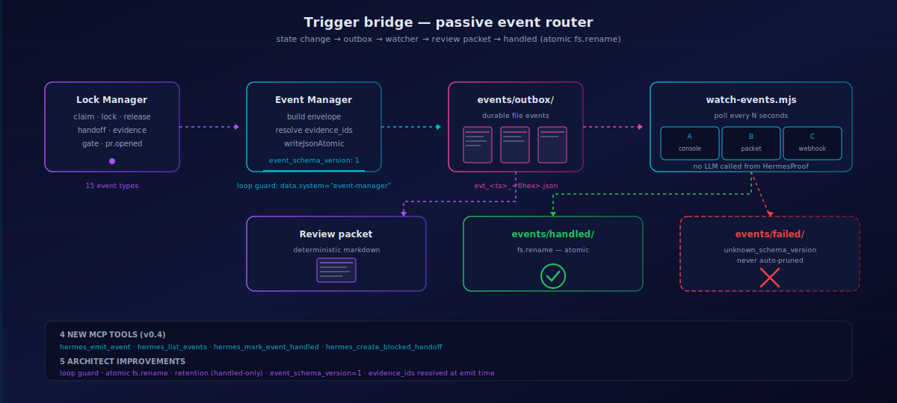
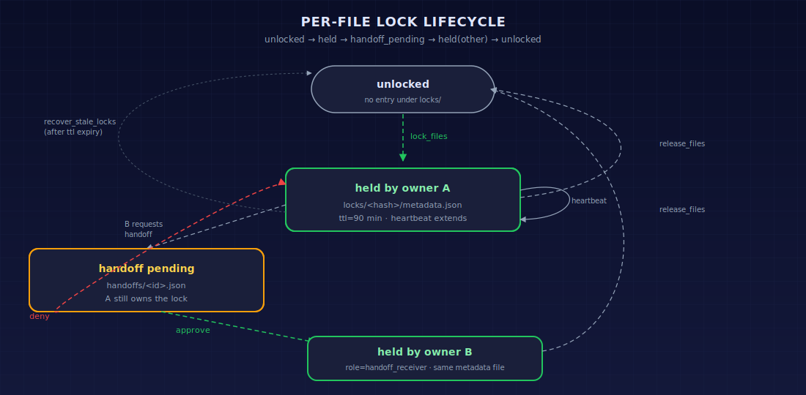
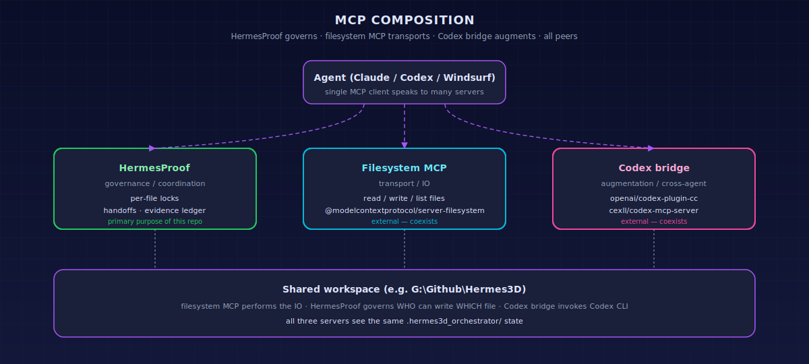

<div align="center">



<br/>

[](https://github.com/Ghenghis/HermesProof/actions/workflows/truth-gates.yml)
[](https://ghenghis.github.io/HermesProof/)
[](https://modelcontextprotocol.io)
[](https://nodejs.org)
[](./LICENSE)
[](https://hermes-agent.nousresearch.com/)

**🌐 Live site → [ghenghis.github.io/HermesProof](https://ghenghis.github.io/HermesProof/)**

**HermesProof** is the verifiable file-lock, proof, and passive trigger-bridge layer that lets **Claude · Codex · Windsurf · Cascade** coordinate edits on the **same repository** — without clobbering each other.

[Quickstart](#-quickstart) · [Pipeline](#-end-to-end-pipeline) · [Truth Gates](#-truth-gates) · [Architecture](#-architecture) · [Coordination](#-multi-agent-coordination) · [Composition](#-composes-with-other-mcp-servers) · [Docs](#-documentation)

</div>

---

## ✦ End-to-end pipeline

Every edit flows through six gates, leaving an immutable trail behind.

<div align="center">

</div>

```text
01 INTENT     agent decides "I want to edit X"
02 CLAIM      claim_task + lock_files (atomic mkdir EEXIST, 90-min TTL)
03 WORK       edit owned files, heartbeat to extend TTL — others see "blocked"
04 HANDOFF    request_handoff → approve_handoff → ownership transferred
05 VERIFY     run_gate (allowlisted: git-status, diff-check, npm-test, audit, …)
06 ATTEST     append_evidence + release_files — append-only NDJSON ledger
```

Every push to `main` re-proves the entire chain through 26 truth gates, signs `PROOF/latest.json` with Sigstore (keyless OIDC), publishes a build-provenance attestation, and commits the refreshed proof bundle back to the repo automatically.

---

## ✦ Truth gates

The proof harness — `npm run truth-gates` — runs twenty-six independent verifications in sequence, capturing structured evidence at every step.

<div align="center">

</div>

| #   | Gate                                      | What it proves                                                                       |
| --- | ----------------------------------------- | ------------------------------------------------------------------------------------ |
| 01  | `source.integrity_manifest`               | SHA-256 manifest of `src/` + `scripts/` — tampering surfaces as hash drift           |
| 02  | `deps.parity`                             | `package.json` declared deps match the installed ones in `node_modules/`             |
| 03  | `tests.unit`                              | All Node smoke tests pass via direct `node --test` (npm pipe-routing bypassed)       |
| 04  | `server.stdio_handshake`                  | Real `node src/server.mjs` boots, completes MCP `initialize`, returns 34 tools       |
| 05  | `doctor.hermes3d`                         | `hermes_doctor` returns `ok: true` against the live workspace                        |
| 06  | `e2e.multi_agent_flow`                    | 14-step real stdio probe: claim → lock → block → handoff → gate → release            |
| 07  | `workspace.integrity`                     | No probe files leaked, no unexpected tracked changes in the workspace                |
| 08  | `clients.config_presence`                 | Claude Desktop, Claude Code, Codex, Windsurf all have `hermes3d-locks` wired         |
| 09  | `clients.claude_code_live`                | `claude mcp list` reports `hermes3d-locks: ✓ Connected` (round-trip live)            |
| 10  | `server.tool_description_hygiene`         | Tool descriptions free of prompt-injection markers (OWASP MCP tool poisoning)        |
| 11  | `evidence.hash_chain_valid`               | Round-trips append + verify, including detection of mid-chain tamper at right index  |
| 12  | `docs.master_prompt_deliverables_present` | All 10 master-prompt design / handoff documents exist, non-empty, with H1 headings   |
| 13  | `events.directory_present`                | `events/outbox`, `events/handled`, and `events/failed` exist after workspace init    |
| 14  | `trigger.doctor_passes`                   | Trigger bridge doctor validates event outbox, schema handling, and review-packet ops |
| 15  | `tasks.directory_present`                 | `tasks/pending`, `tasks/claimed`, `tasks/blocked`, and `tasks/done` exist after init |
| 16  | `queue.doctor_passes`                     | Queue doctor validates enqueue, pick, done, owner affinity, priority, and recovery   |
| 17  | `wizard.dry_run_passes`                   | Universal setup wizard dry-run plans client wiring without writing state             |
| 18  | `provider.registry.validate`              | `policies/provider-registry/registry.yaml` schema + per-entry shape + duplicate scan |
| 19  | `local.models.catalog.validate`           | `lmstudio_local_models.csv` header hygiene; reports invalid rows as findings         |
| 20  | `continue.llm_classes.validate`           | All 62 expected Continue LLM provider names present in `continue_llm_classes.csv`    |
| 21  | `kilocode.provider.mapping.validate`      | Stub gate — runs as `not_applicable` until the KiloCode mapping CSV ships            |
| 22  | `lmstudio.health`                         | LM Studio `LMSTUDIO_BASE_URL` reachable (warn-on-offline, 5s timeout)                |
| 23  | `ollama.health`                           | Ollama `OLLAMA_BASE_URL` reachable (warn-on-offline, 5s timeout)                     |
| 24  | `secret.scan`                             | Repo scanned for secrets via gitleaks; falls back to stdlib regex when unavailable   |
| 25  | `licenses.scan`                           | Every production dep on the SPDX allowlist; GPL/AGPL/LGPL/SSPL/EUPL/BUSL deny-fail   |
| 26  | `dependency.fresh`                        | Direct deps published within 18 months (advisory; warn at 12mo, skip when offline)   |

Outputs:

- `PROOF/latest.json` — machine-readable evidence (gate-by-gate JSON, manifest hashes, config snapshots)
- `PROOF/latest.json.cosign.bundle` — Sigstore keyless signature published to Rekor on every `main` push
- `PROOF_E2E_REPORT.md` — human-readable summary table at the repo root
- GitHub Actions artifact `proof-<sha>` — 90-day retention
- GitHub native build-provenance attestation — verifiable with `gh attestation verify PROOF/latest.json --repo Ghenghis/HermesProof`

> Run locally: `npm run truth-gates` · Run CI-only subset: `npm run truth-gates -- --ci` · Read latest: [`PROOF_E2E_REPORT.md`](./PROOF_E2E_REPORT.md)

---

## ✦ Architecture

Single stdio process per workspace, four MCP clients, durable queue and proof state.

<div align="center">

</div>

The server exposes **42 MCP tools** for coordination, gates, evidence, event outbox operations, queue pickup, anonymous role rotation, USER-session management, A2A task exchange, Hermes Agent bridging, and diagnostics:

```text
CLAIM           claim_task          release_task
LOCK            lock_files          release_files       heartbeat           list_locks
HANDOFF         request_handoff     approve_handoff
GATE            run_gate            list_gates
EVIDENCE        append_evidence     verify_evidence
EVENTS          list_events         emit_event          mark_event_handled
                create_blocked_handoff
QUEUE           enqueue_task        list_pending_tasks  pick_task
                recover_stale_tasks
DIAGNOSTICS     get_state           recover_stale_locks doctor              read_policy
                list_agents
ANONYMOUS       anonymous_claim     anonymous_release   anonymous_state
                record_outcome      record_task         dispatch_recommend
USER SESSION    user_grant_session  user_revoke_session user_check_authorization
A2A             a2a_create_task     a2a_get_task        a2a_update_task     a2a_list_tasks
AGENT           agent_health        agent_request_user_session
                agent_resolve_blocked                   agent_revoke_session
```

Each tool ships with MCP `2025-11-25` annotations (`readOnlyHint`, `destructiveHint`, `idempotentHint`, `openWorldHint`) so clients can render approval prompts that match the actual blast radius — read-only listing tools auto-allow, destructive recovery tools always confirm.

Evidence is hash-chained: every entry binds to the previous via `prev_hash` + canonical-JSON `entry_hash` (sha256), so any after-the-fact rewrite is detected by `hermes_verify_evidence`. State lives in `<workspace>/.hermes3d_orchestrator/`:

The v0.4 trigger bridge is deliberately passive. HermesProof writes durable event JSON files and optional review packets that other processes may observe; it does **not** call an LLM API, open a chat, or directly wake Claude, Codex, Windsurf, or any other session.

```text
.hermes3d_orchestrator/
├── locks/              one directory per locked file (mkdir EEXIST = atomic acquire)
│   └── <hash>/metadata.json
├── tasks/
│   ├── pending/        queued tasks awaiting pickup
│   ├── claimed/        atomically claimed queue tasks
│   ├── blocked/        malformed or scope-blocked queue tasks
│   └── done/           completed queue tasks
├── handoffs/           pending + decided handoff requests
├── evidence/
│   └── ledger.ndjson   append-only attestation log
├── events/
│   ├── outbox/         pending event JSON files
│   ├── handled/        atomically moved after consumer acknowledgement
│   └── failed/         events that need operator inspection
└── review_packets/     optional deterministic Markdown review prompts
```

Event files use `event_schema_version: 1`, are first written through a same-filesystem atomic rename, and are moved from `outbox/` to `handled/` with `fs.rename` so competing watchers cannot double-handle the same event. Retention is intentionally narrow: handled events may be pruned after an operator-chosen cutoff such as 30 days; failed events are never auto-pruned.

Queue task files use `task_schema_version: 1`. `hermes_pick_task` claims the highest-priority owner-matching task by atomically moving it from `tasks/pending/` to `tasks/claimed/`; `hermes_release_task` moves queued work to `tasks/done/`; stale claims can be explicitly returned to pending with `hermes_recover_stale_tasks`.

---

## ✦ Trigger bridge (v0.4)

State changes flow through a passive event router. No LLM is called from HermesProof; the file is the trigger surface.

<div align="center">

</div>

```text
01 STATE CHANGE     lock claimed/released/recovered, handoff created/approved/denied,
                    evidence appended, gate passed/failed, pr.opened
02 EMIT             event-manager builds envelope (event_schema_version: 1),
                    resolves evidence_ids at emit time, writes JSON atomically
03 OUTBOX           events/outbox/evt_<utc_iso_compact>_<6hex>.json
04 WATCH            scripts/watch-events.mjs polls; three modes: console (default),
                    review packet (--write-review-packets), or webhook
                    (HERMESPROOF_WEBHOOK_URL)
05 REVIEW PACKET    deterministic Markdown — same input always produces same output
06 HANDLED / FAILED fs.rename atomic transition to events/handled/ on consumer ack;
                    schema-mismatched envelopes go to events/failed/ (never auto-pruned)
```

Five architect invariants enforced by the implementation:

1. **Loop guard** — internal bookkeeping evidence carries `data.system: "event-manager"`; the lock manager skips re-emit on those rows so `evidence.appended` events don't recurse.
2. **Atomic rename** — every state transition between `outbox/`, `handled/`, `failed/` uses `fs.rename` on the same filesystem; concurrent watchers see `event_already_handled` rather than double-processing.
3. **Retention** — `scripts/prune-events.mjs --before <iso>` prunes only `handled/`. `failed/` is never auto-pruned.
4. **Schema versioning** — `event_schema_version: 1` is required on every envelope. Unknown versions move to `failed/` with `error: "unknown_schema_version"`.
5. **`evidence_ids` at emit time** — resolved from the chained ledger when the event is written, not when it's consumed; consumers don't re-walk the chain.

A separate **GitHub Actions mechanical-review workflow** (`.github/workflows/hermesproof-review-check.yml`) runs without an LLM on every PR open and asserts: PR body contains the evidence-chain line, references a task id, lists at least one gate, has changed files, has a valid handoff if `handoffs/HANDOFF_*.md` is added, and the README tool count matches the server's registered tool count.

---

## ✦ Multi-agent coordination

Claude leads with docs and contracts. Codex implements code. Reviewers audit. HermesProof keeps them out of each other's way.

<div align="center">

</div>

### Per-file lock lifecycle

<div align="center">

</div>

The state machine is intentionally minimal:

- **unlocked** → no entry under `locks/`
- **held by owner A** → `locks/<hash>/metadata.json` exists; only A can release; heartbeat extends TTL
- **handoff pending** → `handoffs/<id>.json` exists; A still owns the lock
- **held by owner B** → after A approves; same metadata file, role updated to `handoff_receiver`
- **stale recovery** → after TTL expiry, any agent can call `recover_stale_locks` (the only safe override path)

---

## ✦ Composes with other MCP servers

HermesProof is intentionally narrow: it is the **governance layer**. It coexists with — never competes with — filesystem, transport, and bridge MCPs.

<div align="center">

</div>

| Concern                                            | Server                                                                                                                                        | Status                |
| -------------------------------------------------- | --------------------------------------------------------------------------------------------------------------------------------------------- | --------------------- |
| Per-file ownership / locking / handoffs / evidence | **HermesProof** (this repo)                                                                                                                   | shipped here          |
| Read / write / list files                          | [`@modelcontextprotocol/server-filesystem`](https://github.com/modelcontextprotocol/servers)                                                  | external — coexists   |
| Claude → Codex bridge                              | [`openai/codex-plugin-cc`](https://github.com/openai/codex-plugin-cc) · [`cexll/codex-mcp-server`](https://github.com/cexll/codex-mcp-server) | external — coexists   |
| Multi-agent spawning / routing                     | [`ruvnet/claude-flow`](https://github.com/ruvnet/claude-flow)                                                                                 | external — runs above |

See [`docs/INTEROP_WITH_OTHER_MCP.md`](./docs/INTEROP_WITH_OTHER_MCP.md) for full composition recipes.

---

## ✦ Quickstart — works for ANY repository

HermesProof is **project-agnostic by design**. Point `--workspace` at any local directory — a fresh repo, a legacy codebase, a monorepo, a documentation project. The `hermes3d-locks` MCP server name is a deployed-name carry-over from the original Hermes3D workflow, but the server governs whatever workspace you give it.

```powershell
# 1. Clone HermesProof itself (the orchestrator)
git clone https://github.com/Ghenghis/HermesProof.git
cd HermesProof
npm install

# Fastest path: run the universal setup wizard.
npm run wizard

# 2. Verify the package (no workspace needed yet)
npm run truth-gates                                            # 26/26 gates pass
npm test                                                       # Node smoke tests pass

# 3. Pick the workspace HermesProof will govern. Examples:
#       Windows:  $WORKSPACE = "G:\Github\my-project"
#       macOS:    WORKSPACE=~/code/my-project
#       Linux:    WORKSPACE=/home/me/work/my-project
$WORKSPACE = "G:\Github\my-project"           # <-- change this to YOUR repo

# 4. Non-destructive readiness probe
npm run doctor -- --workspace $WORKSPACE

# 5. Bootstrap the workspace state directory (creates .hermes3d_orchestrator/)
npm run init-project -- --workspace $WORKSPACE

# 6. Wire it into every MCP client (timestamped backups of any prior config)
npm run install-clients -- --workspace $WORKSPACE

# 7. Confirm it's live
claude mcp list                                                # expect "hermes3d-locks: ✓ Connected"
```

After step 6, restart Claude Desktop and Codex; refresh MCP servers in Cascade. Tell any agent:

```text
Use hermes_doctor and hermes_read_policy. Confirm workspace_root.
Then claim_task + lock_files before editing anything.
```

### Use cases (each is a `--workspace <path>` away)

| Project type | Example `--workspace` |
|---|---|
| Solo dev wiring 2+ AI agents into a personal repo | `~/code/my-app` |
| Team using Claude + Codex in a shared monorepo | `/srv/team/monorepo` |
| Open-source maintainer reviewing community PRs | `~/oss/my-library` |
| Hermes3D workflow (the original target) | `G:\Github\Hermes3D` |

**No GitHub repo required.** HermesProof governs the local filesystem. If your project lives only on disk (no remote, no `.git/`, even), it still works — `init-project` creates the state dir, locks govern files, gates run shell commands. The truth-gate harness uses git only when it's there.

For deeper recipes (CI integration, multi-machine coordination, etc.), see [`docs/SETUP_GENERIC_PROJECT.md`](./docs/SETUP_GENERIC_PROJECT.md).

---

## ✦ MCP client configuration

Four clients are supported; `npm run install-clients` writes all of them with timestamped backups. Manual JSON for reference:

<details>
<summary><b>Claude Desktop</b> · <code>%APPDATA%\Claude\claude_desktop_config.json</code></summary>

```json
{
  "mcpServers": {
    "hermes3d-locks": {
      "command": "node",
      "args": ["G:\\Github\\HermesProof\\src\\server.mjs"],
      "env": { "MCP_LOCK_WORKSPACE": "G:\\Github\\Hermes3D" }
    }
  }
}
```
</details>

<details>
<summary><b>Claude Code</b> · CLI</summary>

```powershell
claude mcp add --transport stdio hermes3d-locks --scope user `
  --env MCP_LOCK_WORKSPACE="G:\Github\Hermes3D" `
  -- node "G:\Github\HermesProof\src\server.mjs"
```
</details>

<details>
<summary><b>Codex</b> · <code>~/.codex/config.toml</code></summary>

```toml
[mcp_servers.hermes3d-locks]
command = "node"
args = ["G:\\Github\\HermesProof\\src\\server.mjs"]
env = { MCP_LOCK_WORKSPACE = "G:\\Github\\Hermes3D" }
enabled = true
startup_timeout_sec = 10
tool_timeout_sec = 60
# Keep serialized for lock correctness; do not enable parallel tool calls.
```
</details>

<details>
<summary><b>Windsurf · Cascade</b> · <code>~/.codeium/windsurf/mcp_config.json</code></summary>

```json
{
  "mcpServers": {
    "hermes3d-locks": {
      "command": "node",
      "args": ["G:\\Github\\HermesProof\\src\\server.mjs"],
      "env": { "MCP_LOCK_WORKSPACE": "G:\\Github\\Hermes3D" }
    }
  }
}
```
</details>

---

## ✦ Environment

| Variable               | Default                  | Purpose                                                            |
| ---------------------- | ------------------------ | ------------------------------------------------------------------ |
| `MCP_LOCK_WORKSPACE`   | `cwd()`                  | Absolute path of the workspace HermesProof governs                 |
| `HERMES3D_WORKSPACE`   | —                        | Legacy alias for `MCP_LOCK_WORKSPACE` (still honored)              |
| `MCP_LOCK_STATE_DIR`   | `.hermes3d_orchestrator` | Name of the state dir inside the workspace; rejects slashes / `..` |
| `MCP_LOCK_SERVER_NAME` | `hermes3d-locks`         | Name surfaced to MCP clients (only used by `print-configs`)        |

---

## ✦ Documentation

- **[`docs/ARCHITECTURE.md`](./docs/ARCHITECTURE.md)** — full system deep-dive with all diagrams
- **[`docs/LOCK_PROTOCOL.md`](./docs/LOCK_PROTOCOL.md)** — exactly when and how locks are acquired and released
- **[`docs/TOOL_REFERENCE.md`](./docs/TOOL_REFERENCE.md)** — every MCP tool, with example arguments and responses
- **[`docs/EVENT_SCHEMA.md`](./docs/EVENT_SCHEMA.md)** — trigger bridge event envelope, lifecycle, concurrency, and retention
- **[`docs/SECURITY_POLICY.md`](./docs/SECURITY_POLICY.md)** — what the server will and will not do, threat model, allowlist
- **[`docs/INTEROP_WITH_OTHER_MCP.md`](./docs/INTEROP_WITH_OTHER_MCP.md)** — composing with filesystem MCP, Codex bridges, claude-flow
- **[`docs/MAINTENANCE.md`](./docs/MAINTENANCE.md)** — repair scripts, debugging recipes, release checklist
- **[`docs/SETUP_CLAUDE_DESKTOP.md`](./docs/SETUP_CLAUDE_DESKTOP.md)** · **[`docs/SETUP_CLAUDE_CODE.md`](./docs/SETUP_CLAUDE_CODE.md)** · **[`docs/SETUP_CODEX.md`](./docs/SETUP_CODEX.md)** · **[`docs/SETUP_WINDSURF.md`](./docs/SETUP_WINDSURF.md)**
- **[`docs/SETUP_GENERIC_PROJECT.md`](./docs/SETUP_GENERIC_PROJECT.md)** — install into any repo (not just Hermes3D)
- **[`AGENTS.md`](./AGENTS.md)** — mandatory rules for any agent operating against this server
- **[`PROOF_E2E_REPORT.md`](./PROOF_E2E_REPORT.md)** — latest auto-generated proof report

---

## ✦ Inspiration & credits

HermesProof carries the [Hermes Agent](https://hermes-agent.nousresearch.com/) lineage from [Nous Research](https://nousresearch.com/) — the same emphasis on **verifiable, agentic capability** with an immutable trail of evidence.

Where Nous's [`hermes-agent`](https://github.com/nousresearch/hermes-agent) reasons and acts, HermesProof **governs and attests**: it is the layer that lets multiple Hermes-class agents cooperate on a real codebase without stepping on each other.

Built for the [Hermes3D](https://github.com/Ghenghis/Hermes3D) workflow; project-agnostic by design.

---

<div align="center">

`hermes3d-locks` is the deployed MCP server name (already wired into client configs).
**HermesProof** is the project, the harness, and the proof bundle.

</div>
