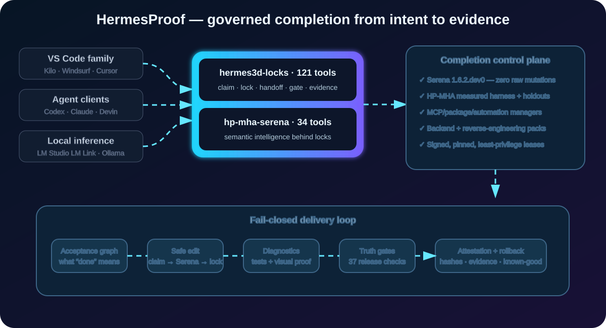
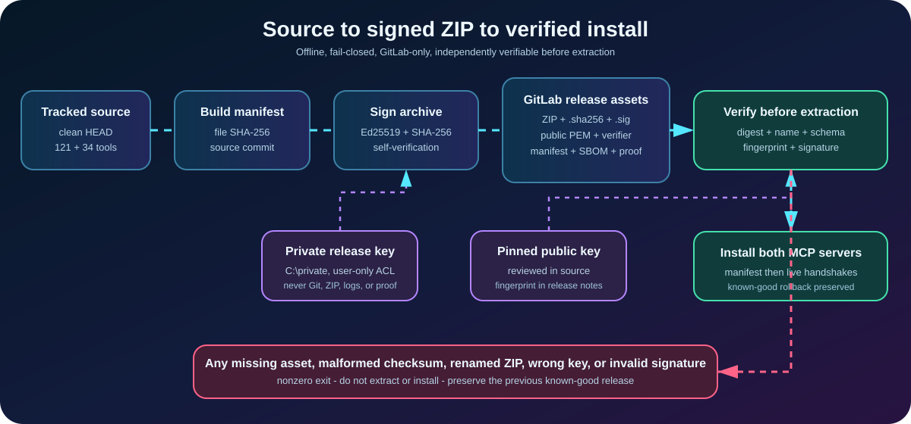
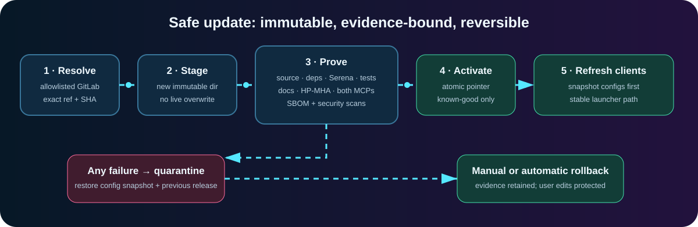
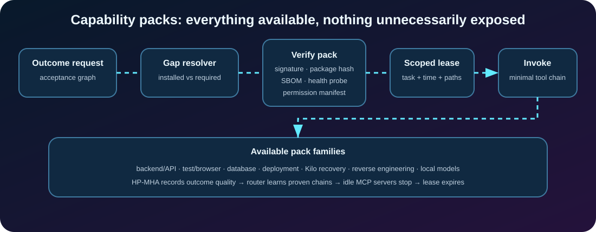
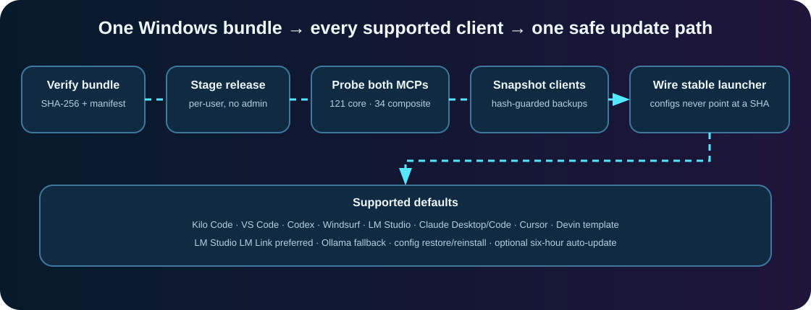

<div align="center">



# HermesProof

**A fail-closed coordination, semantic-intelligence, harness, capability, and release control plane for coding agents.**

[](https://gitlab.com/Ghenghis/HermesProof/-/releases)
[](https://gitlab.com/Ghenghis/HermesProof)
[](https://github.com/Ghenghis/HermesProof)
[](https://ghenghis.gitlab.io/HermesProof)
[](https://nodejs.org)
[](LICENSE)

[Live release site](https://ghenghis.gitlab.io/HermesProof) ·
[GitHub release mirror](https://github.com/Ghenghis/HermesProof/releases) ·
[Windows install](docs/WINDOWS_INSTALL.md) ·
[Release verification](docs/WINDOWS_INSTALL.md#verify-before-extraction) ·
[Updater runbook](docs/UPDATER_RUNBOOK.md) ·
[Tool reference](docs/TOOL_REFERENCE.md) ·
[Troubleshooting](docs/TROUBLESHOOTING_UPDATES.md)

</div>

HermesProof turns a requested outcome into an acceptance graph, scopes operations that pass through its control plane, prevents colliding edits, proves the result, and preserves a known-good release rollback path. It ships as **two MCP servers in one monorepo**:

- `hermes3d-locks` — **121 tools** for tasks, file locks, handoffs, gates, evidence, releases, clients, GitLab, diagnostics, queues, agent communication, and project hygiene.
- `hp-mha-serena` — **34 governed tools** for HP-MHA harness execution, Serena semantic intelligence, capability packs, backend recovery, automation, MCP lifecycle management, and safe updates.

Serena **1.7.0** is pinned by immutable commit and integrated using its current `language_servers:` project schema. Its 52-tool catalog is policy-filtered: 29 are available in the upstream desktop context, 15 semantic/LSP operations are selectable through the governed adapter, and **zero raw mutation tools** are active there. Semantic reads require a workspace-bound handle; Hermes mutations additionally require a claimed task, exact locks, source hashes, one-use receipts, evidence, and rollback. The 1.7 runtime adds parallel-client race fixes, timeout recovery, surfaced activation errors, language-server health status, and safer localhost/template handling.



## What this release solves

- Multiple agents can work in one repository without silently overwriting one another.
- Kilo Code and other clients get a dependable backend/tooling fallback when their built-in toolchain is incomplete.
- The current local capability resolver selects pinned, integrity-checked packs instead of permanently exposing every MCP server.
- Serena supplies symbol-aware navigation, diagnostics, references, implementations, and refactors without bypassing Hermes locks.
- HP-MHA compares harness/tooling outcomes with retained hash-bound measurements, tag checks, and server-derived holdout-path guards.
- User-facing progress can be backed by live MCP probes, tests, visual evidence, a hash-chained ledger, and 37 truth gates.
- Updates stage immutably, snapshot client configs, probe both servers, quarantine failures, and roll back to a known-good release.

## Install on Windows 11

The release ZIP is the recommended path for another PC. It is per-user, does not require administrator rights, verifies its manifest, probes both MCP servers, snapshots existing client configuration, and uses a stable launcher so later upgrades do not rewrite every client.



Download the ZIP, its exact `.sha256` and `.sig` sidecars, `hermesproof-release-ed25519-public.pem`, and `verify-hermesproof-release.mjs` into one folder. Verify the download before extraction:

```powershell
node .\verify-hermesproof-release.mjs --artifact .\HermesProof-v0.9.2-windows-x64.zip --public-key .\hermesproof-release-ed25519-public.pem
```

The command must print `[PASS] HermesProof release verified`. Any checksum, filename, public-key fingerprint, envelope, or Ed25519 signature mismatch exits nonzero. From a source checkout containing exactly one official Windows ZIP in `dist`, run `npm run release:verify`. For a custom path, invoke `node scripts/verify-hermesproof-release.mjs --artifact <zip> --public-key config/hermesproof-release-ed25519-public.pem` directly so PowerShell/npm option forwarding cannot alter the arguments.

```powershell
Set-ExecutionPolicy -Scope Process Bypass
.\install-hermesproof.ps1 -Workspace "G:\Github\your-project" -AutoUpdate
```

For development from this source checkout:

```powershell
npm ci
npm run docs:check
npm run test:updater
npm test
npm run install-clients -- --workspace "G:\Github\your-project"
```

See [Windows install, repair, backup, and uninstall](docs/WINDOWS_INSTALL.md).

## Supported clients and local models

| Target | Installed behavior |
| --- | --- |
| Kilo Code / VS Code | Both MCP servers in current `.kilo/kilo.json` or VS Code MCP configuration; primary supported workflow |
| Codex | Both servers through the stable launcher |
| Windsurf | Both servers in the Windsurf MCP configuration |
| Cursor | Both servers in the Cursor MCP configuration |
| Claude Desktop | Both servers in the desktop configuration |
| Claude Code | Both servers installed or refreshed with `claude mcp`; the real user MCP store `~/.claude.json` is snapshotted |
| LM Studio | MCP host wiring plus a local-model route; LM Link is preferred |
| Ollama | Local inference fallback when LM Studio/LM Link is unavailable; it is not misrepresented as an MCP host |
| Devin | Exportable MCP configuration template for the Devin environment |

Existing files are backed up in an immutable, SHA-bound manifest and recorded with before/after hashes. Restore refuses to overwrite configuration that the user changed after installation. Repeat uninstall is idempotent, and a requested purge stops without deleting recovery data if client restoration cannot be proven.

## Safe daily workflow

```text
init
  workspace + Serena project + client wiring + baseline evidence

doctor --deep
  locks + symbols + GitLab + clients + harness + local models + package health

safe-edit
  claim → semantic analysis → exact lock → edit → diagnostics → tests → visual evidence

release
  clean tree → real two-server E2E → truth gates → attestation → GitLab release
```

The mutation boundary is strict: claim a task, acquire the exact operation/file lock, supply an idempotency key, then invoke the operation. Duplicate identical requests collapse; altered payloads are rejected and logged.

## Updates, backup, and rollback



```powershell
hermesproof-update status
hermesproof-update check
hermesproof-update apply --channel stable
hermesproof-update rollback
hermesproof-update auto enable
hermesproof-update evidence
```

Only credential-free HTTPS sources under `gitlab.com/Ghenghis/HermesProof`, approved refs, and exact commit SHAs are accepted. Production activation requires nine named gates: source integrity, dependency parity, current Serena configuration, the complete Node test suite, documentation drift, real HP-MHA verification, both live MCP probes, SBOM generation, and security scans. No skipped gate can activate a release.

The Windows scheduler runs at most every six hours with jitter, backoff, a maintenance window, and missed-run recovery. Linux can use a non-root persistent systemd user timer. Read the [updater runbook](docs/UPDATER_RUNBOOK.md) before changing channels.

## Just-in-time capability packs



HermesProof does **not** enable every shell, filesystem, package, and MCP server at once. v0.9.2 ships a two-entry local catalog, a minimum-pack resolver, one apply-capable pinned npm path, package-lock/integrity/executable/SBOM checks, health probes, owner/workspace/task/time leases, and default-disabled runtime lifecycle controls. Publisher-signature/transparency verification, registry discovery, multi-format adapters, and pack rollback execution are planned controls, not v0.9.2 claims.

The implemented boundary is:

- register, lease, enable, cycle, revoke, health-check, and idle-disable hash-bound local runtimes;
- install the pinned Kilo npm capability into a workspace-local directory with scripts disabled;
- plan the reverse-engineering inventory pack (its non-npm apply adapter is not shipped yet);
- persist desired state for three fixed recurring recipes through Windows Task Scheduler or Linux user timers, then reauthorize the owner/task/lease before every run;
- diagnose Kilo/Node/Bun/Git/GitLab/Docker/Ollama/LM Studio/indexing/integration gaps without claiming database, API, migration, container, or browser recovery packs;
- LM Studio LM Link preference with Ollama fallback for private/local inference.

### Sandboxing status

v0.9.2 does **not** claim a real OS sandbox. `sandbox_path` is a workspace-local install directory; `shell:false`, sanitized child environments, hashes, leases, and default-disabled state are process hardening, not filesystem or network confinement. Capability children still run as the current OS user. Untrusted execution therefore remains disabled by policy until a separately reviewed Windows WSL2/Hyper-V and Linux namespace/microVM broker is implemented. External filesystem or shell MCP servers can also bypass Hermes locks if a client invokes them directly; see [interop limitations](docs/INTEROP_WITH_OTHER_MCP.md).

## HP-MHA harness

HP-MHA is a real, fail-closed harness layer. Harness cards are validated for schema and installed provenance; they are not assigned results from an unrelated benchmark. The exact Kilo backend benchmark separately loads, cell-binds, re-scores, and digest-verifies its retained 2×2 raw responses. Public MCP lock requests are denied for reserved holdout paths or tags regardless of a caller-supplied role. A run computes the trace Merkle root and fails if trace verification fails; it never prints a success marker after a failed proof. A separately owned evaluator process and result channel remain future hardening and are not claimed by v0.9.2.

Harness evidence and ordinary HermesProof coordination evidence remain distinct but linkable. The composite server can use measured outcomes to prefer the tool chain that actually completes a project type.

## Evidence and release truth

`npm run truth-gates` runs 37 checks and emits machine- and human-readable proof. Critical release actions require:

- real stdio initialization and `tools/list` for both servers;
- exact tool counts (121 core, 34 composite);
- valid hash-chain and Merkle verification;
- dependency/SBOM/security evidence;
- workspace and client configuration integrity;
- no template/FIXME harness cards or placeholder matrix;
- generated documentation matching `config/release-facts.json`.

Generated current facts are in [docs/GENERATED_RELEASE_FACTS.md](docs/GENERATED_RELEASE_FACTS.md). The canonical source is [config/release-facts.json](config/release-facts.json).

## Architecture and security



Official archives are signed offline. The Ed25519 private key stays outside the repository under `C:\private`; the reviewed public key is pinned in Git. The builder refuses an official filename without the matching private key, emits exact checksum/signature sidecars, and self-verifies them before returning success.

HermesProof is local-first and workspace-scoped. It never stores GitLab credentials in repository files, release artifacts, updater evidence, or client configs. Process execution uses exact argument arrays with `shell: false`, an environment allowlist, bounded output, timeouts, and redaction. Root/home/repository/traversal/link targets are rejected for managed updates.

Reverse-engineering support is for software, devices, firmware, and data the operator owns or is authorized to analyze. Packs start read-only where possible, stay local by default, and inherit the same locks, evidence, package hashes, and least-privilege leases as other capabilities.

## Documentation

- [Current release and source of truth](docs/CURRENT_RELEASE_STATUS.md)
- [Architecture](docs/ARCHITECTURE.md)
- [Windows install](docs/WINDOWS_INSTALL.md)
- [Updater runbook](docs/UPDATER_RUNBOOK.md)
- [Update troubleshooting](docs/TROUBLESHOOTING_UPDATES.md)
- [Local models and authorized reverse engineering](docs/LOCAL_MODELS_AND_REVERSE_ENGINEERING.md)
- [Serena integration](docs/SERENA_INTEGRATION.md)
- [Tool reference](docs/TOOL_REFERENCE.md)
- [Security policy](docs/SECURITY_POLICY.md)
- [GitLab release runbook](docs/GITLAB_RELEASE_RUNBOOK.md)
- [Maintenance](docs/MAINTENANCE.md)

## Development and contribution

```powershell
git clone https://gitlab.com/Ghenghis/HermesProof.git
cd HermesProof
npm ci
npm run docs:generate
npm test
```

Use a feature branch and a GitLab merge request. Do not commit secrets, generated caches, `node_modules`, temporary worktrees, private model files, or unrelated vendored tools.

MIT licensed. Project home: [gitlab.com/Ghenghis/HermesProof](https://gitlab.com/Ghenghis/HermesProof).
