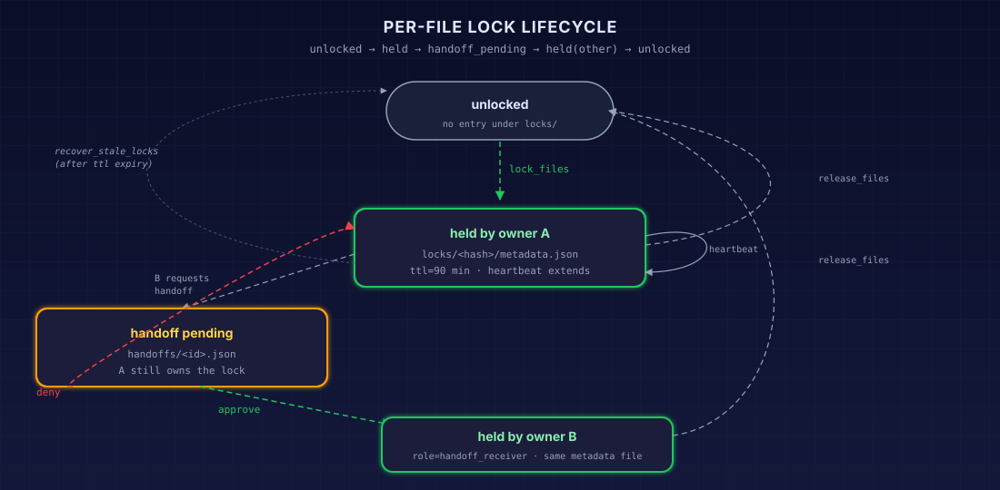
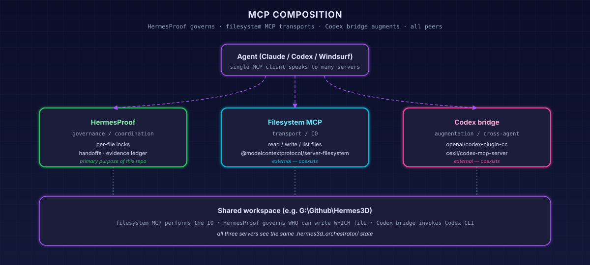

# HermesProof — Architecture

This document is the consolidated technical view of HermesProof. Every other doc in `docs/` is a deeper dive into one slice of what's described here.

## 1. System overview

<div align="center">

</div>

HermesProof is **one Node process per workspace**. It speaks JSON-RPC over stdio (MCP `2025-11-25`), is single-threaded by design (so its lock state cannot race against itself), and writes to a single hidden directory inside the workspace.

| Layer | What it does | Where it lives |
| --- | --- | --- |
| Clients | Claude Desktop, Claude Code, Codex, Windsurf | each in its own MCP config file |
| Transport | stdio JSON-RPC, MCP 2025-11-25 | `@modelcontextprotocol/sdk` |
| Server | 116 MCP tools across coordination, workspace switching, workspace release hygiene, project connection, workspace bug tickets, testing/release mode, project contracts, anti-slop reviews, claim audits/correction packets, agentic loop ticks, agent watchdog recovery, agent profiles, agent presence, inbox messaging, assistance routing, skills routing, unlock requests, live status, event long-polling, backend/GitLab readiness, GitLab project and merge-request work, WinMerge comparison, gates, evidence, events, queue pickup, anonymous orchestration, provider-performance routing, KiloCode/OpenHands delegation governance, KiloCode project guardrails/checkpoints, KiloCode agent-bus proof enforcement, A2A task exchange, Hermes Agent bridging, HP-MHA Model–Harness Attribution, diagnostics | [`src/server.mjs`](../src/server.mjs) |
| Lock manager | atomic mkdir, heartbeat, handoff, evidence | [`src/core/lock-manager.mjs`](../src/core/lock-manager.mjs) |
| Event manager | passive outbox events, atomic moves, review-packet inputs | `src/core/event-manager.mjs` |
| Queue manager | passive task queue, priority pickup, stale-task recovery | `src/core/queue-manager.mjs` |
| Gate runner | allowlisted command execution | [`src/core/gate-runner.mjs`](../src/core/gate-runner.mjs) |
| Path safety | env-var resolution, escape rejection | [`src/core/fs-utils.mjs`](../src/core/fs-utils.mjs) |
| Persistence | task queue directories, event outbox directories, agent profiles, presence records, per-owner inboxes, project contracts, contract reviews, claim audits, bug tickets, NDJSON evidence ledger, per-lock metadata | `<workspace>/.hermes3d_orchestrator/` |

## 1.1 Memory and database model

HermesProof uses a file-backed state database inside each workspace. Durable memory lives under `.hermes3d_orchestrator/`: locks, tasks, handoffs, agent profiles, presence, inbox messages, project contracts, contract reviews, claim audits/correction packets, bug tickets, events, and the hash-chained evidence ledger. The Node process uses only temporary in-memory caches and live objects; restarting the MCP server reloads durable state from disk.

There is no required external SQL, document, or vector database. That is intentional: any repo can carry its own coordination state, and truth gates can audit it with normal filesystem tools. A future adapter can mirror state to SQLite, Postgres, or vector memory if a workspace genuinely needs cross-machine query or semantic recall, but the local file database remains the source of truth.

## 2. End-to-end pipeline

<div align="center">

</div>

Every successful edit traverses six logical stages:

1. **Intent** — agent decides what file(s) to touch.
2. **Claim** — `hermes_claim_task` then `hermes_lock_files`. Atomic via `mkdir(EEXIST)`. TTL = 90 minutes.
3. **Work** — agent edits owned files. `hermes_heartbeat` extends TTL while work continues.
4. **Handoff** (optional branch) — another agent calls `hermes_request_handoff`; current owner calls `hermes_approve_handoff`. Ownership transfers atomically.
5. **Verify** — `hermes_run_gate` runs an allowlisted command (git, npm, npx). Output captured to evidence ledger.
6. **Attest + release** — `hermes_append_evidence` records the human-readable summary; `hermes_release_files` and `hermes_release_task` clear ownership.

Every stage writes append-only evidence. Nothing is silently mutated.

CP-HERMESPROOF-0.4 adds a passive event bridge beside the existing proof layer:

```text
state change
  -> lock manager appends evidence
  -> event manager writes event_schema_version=1 JSON to events/outbox via tmp + rename
  -> optional watcher prints, posts, or writes a review packet
  -> consumer may atomically rename outbox/<id>.json to handled/<id>.json
```

The bridge is intentionally not a chat wake-up system. HermesProof never calls an LLM API and never reaches into a Claude, Codex, or Windsurf session. It creates durable files that external watchers can observe.

CP-HERMESPROOF-0.5 adds a passive queue beside the trigger bridge:

```text
enqueue task -> tasks/pending/<id>.json
agent standing prompt calls hermes_pick_task
pending/<id>.json --fs.rename--> claimed/<id>.json
release_task marks queue work done -> tasks/done/<id>.json
```

The queue improves pickup discipline but still does not auto-start agents.

CP-HERMESPROOF-0.8 adds project contracts and anti-slop reviews:

```text
agent claim + changed files + gates
  -> hermes_anti_slop_review reads project contract
  -> bounded local checks run without unbounded repo scans
  -> review JSON is saved under contract_reviews/
  -> high/critical findings can auto-open bug tickets
  -> contract.reviewed or slop.detected event reaches live agents
```

The contract layer is meant to keep work fast. If the caller supplies the changed file list, HermesProof skips git shortstat and scans only bounded file content, with default caps that prevent slow reviews on large repos.

CP-HERMESPROOF-0.9 adds the agentic claim-audit loop:

```text
agent answer / status / plan
  -> hermes_decompose_claims creates structured factual claims
  -> hermes_audit_claims checks evidence, gates, and project contracts
  -> claim.audit.passed or claim.audit.failed event reaches live agents
  -> correction packet lists exact claims to fix and targeted grounding tools
  -> hermes_agentic_tick ranks providers, checks active agents, queues follow-up
  -> optional ticket / inbox message / provider outcome keeps the work moving
```

This is intentionally low latency. The default `instant` mode is deterministic
and local; it produces grounding requests rather than calling cloud models. The
tick tool is the bounded agentic step: it can keep MiniMax as live controller,
ask DeepSeek/SiliconFlow/LM Studio for the next role, enqueue correction work,
and stop after repeated no-progress cycles instead of pretending autonomy.

`hermes_agent_watchdog` is the fail-safe layer. It watches presence TTLs, idle
duration, claimed-task heartbeat age, owned locks, and recovery checkpoints. If
an agent falls asleep or freezes, the watchdog can poke its inbox, emit a
watchdog event, recover truly stale ownership after TTL, and enqueue a resume
task for another agent with the last known task, locks, notes, and evidence id.

HermesProof does not update model weights at runtime. Its learning layer is
proof-backed memory: claim audits, game/project profiles, checkpoints,
provider-performance outcomes, and evidence-ledger traces. Fine-tuning or LoRA
training should use exported high-quality traces later, after the data is clean.

## 3. Lock lifecycle

<div align="center">

</div>

The lock state machine is intentionally minimal. There are exactly four states per file:

```text
unlocked  →  held(A)  →  handoff_pending  →  held(B)  →  unlocked
                ↑                                ↓
                └──── recover_stale_locks ───────┘   (only after TTL expiry)
```

Implementation notes:

- **Atomicity** comes from `fs.mkdir(lockDir, { recursive: false })`. EEXIST means another owner already won the race.
- **Path-escape safety** — the lock manager refuses any file path that resolves outside `safeWorkspaceRoot()`. This is checked before *any* state mutation.
- **TTL is metadata, not enforcement** — locks aren't auto-released; another agent must call `hermes_recover_stale_locks` to take over. This avoids races with mid-edit agents whose computers briefly slept.
- **Handoffs require explicit consent** — there is no "force takeover" path that doesn't appear in the evidence ledger.

## 4. Multi-agent coordination

<div align="center">

</div>

The reference deployment splits responsibility three ways:

| Agent | Owns | Reads | Tool surface |
| --- | --- | --- | --- |
| Claude Lead (architect) | docs, contracts, scope locks, review prompts | code (read-only) | `claim_task`, `lock_files`, `append_evidence` |
| Codex (implementer) | code (`.tsx`, `.ts`, `.py`, `.mjs`, …) | docs, contracts (read-only) | full coordination + `run_gate` |
| KiloCode / Windsurf | IDE-side repairs, local verification | owned task context | full coordination + inbox |
| MiniMax M3 in Cheat Engine Chat | user-granted host work such as code, docs, tests, git operations | workspace and inbox | full coordination + external host tools |
| Claude Reviewer | correction packets, review notes | everything (read-only by default) | `request_handoff` for surgical patches |

The coordination contract: *no agent edits a file unless it owns the lock or holds an approved handoff*. This is enforced by the server, not by convention.

## 5. Truth-gate harness

<div align="center">

</div>

`scripts/truth-gates.mjs` is the attestation runner. Thirty-seven independent gates, each producing structured evidence:

Evidence ledger verification is checkpoint-aware. `hermes_verify_evidence` still validates every entry hash and every link, but it may return `ok: true` with `strict_ok: false` when a hash-checked checkpoint manifest explicitly accepts documented historical fork rows. The local 2026-05-03 fork is handled this way so HermesProof preserves the original ledger bytes while still failing any new or unlisted break.

| # | Gate | Implementation |
| - | --- | --- |
| 01 | `source.integrity_manifest` | SHA-256 manifest of `src/` + `scripts/` so tampering surfaces as hash drift |
| 02 | `deps.parity` | `package.json` declared deps match installed versions in `node_modules/` |
| 03 | `tests.unit` | All Node smoke tests pass via direct `node --test` |
| 04 | `server.stdio_handshake` | Real `node src/server.mjs` boots, completes MCP `initialize`, returns 102 MCP tools |
| 05 | `doctor.hermes3d` | `hermes_doctor` returns `ok: true` against the live workspace when local gates are enabled |
| 06 | `events.directory_present` | `events/outbox`, `events/handled`, and `events/failed` exist after init |
| 07 | `tasks.directory_present` | `tasks/pending`, `tasks/claimed`, `tasks/blocked`, and `tasks/done` exist after init |
| 08 | `trigger.doctor_passes` | Trigger bridge doctor validates event outbox, schema handling, and review packets |
| 09 | `queue.doctor_passes` | Queue doctor validates enqueue, pick, done, owner affinity, priority, and recovery |
| 10 | `wizard.dry_run_passes` | Universal setup wizard dry-run plans client wiring without writing state |
| 11 | `e2e.multi_agent_flow` | 14-step real stdio probe: claim -> lock -> block -> handoff -> gate -> release |
| 12 | `workspace.integrity` | No probe files leaked and no unexpected tracked changes in the workspace |
| 13 | `clients.config_presence` | Claude Desktop, Claude Code, Codex, and Windsurf configs are wired |
| 14 | `clients.claude_code_live` | `claude mcp list` reports `hermes3d-locks` connected when local gates are enabled |
| 15 | `server.tool_description_hygiene` | Tool descriptions are free of prompt-injection markers |
| 16 | `security.mcp_scan_pass` | Static MCP poisoning scan over `src/server.mjs` passes |
| 17 | `evidence.hash_chain_valid` | Round-trips append + verify, including detection of mid-chain tamper |
| 18 | `docs.master_prompt_deliverables_present` | Required design and handoff documents exist, non-empty, with H1 headings |
| 19 | `provider.registry.validate` | `policies/provider-registry/registry.yaml` schema and duplicate checks pass |
| 20 | `local.models.catalog.validate` | `lmstudio_local_models.csv` is schema-valid and non-empty |
| 21 | `continue.llm_classes.validate` | All 62 expected Continue LLM provider names are present |
| 22 | `kilocode.provider.mapping.validate` | KiloCode provider mapping gate reports applicable status or explicit N/A |
| 23 | `lmstudio.health` | LM Studio endpoint health probe runs as warn-on-offline |
| 24 | `ollama.health` | Ollama endpoint health probe runs as warn-on-offline |
| 25 | `backend.api_config_presence` | Backend API env/CLI inventory runs without leaking secret values |
| 26 | `gitlab.auth_probe` | GitLab auth probe reports authenticated or missing-token status without leaking secrets |
| 27 | `secret.scan` | Repo secret scan runs via gitleaks or stdlib fallback |
| 28 | `secrets.rotation_evidence_present` | Secret-rotation evidence is present when required |
| 29 | `sbom.cyclonedx_generated` | CycloneDX SBOM generation succeeds |
| 30 | `licenses.scan` | Production dependency licenses pass the SPDX allow/deny policy |
| 31 | `dependency.fresh` | Direct deps freshness check runs with advisory windows |
| 32 | `security.workflow_actions_sha_pinned` | GitHub Actions are pinned according to workflow hardening policy |
| 33 | `accessibility.wcag_aa_pass` | Accessibility gate reaches WCAG AA policy status |
| 34 | `perf.budgets_pass` | Performance budgets gate reaches policy status |
| 35 | `docs.reflects_changes` | Docs reflection gate verifies user-facing changes are documented |
| 36 | `release.checksums_present` | Release checksum artifacts are present when required |
| 37 | `quality.coderabbit_reviewed` | CodeRabbit review gate records reviewed or skipped status |

CLI:

```text
node scripts/truth-gates.mjs               # run all 37 against your local Hermes3D
node scripts/truth-gates.mjs --ci          # skip the 4 local-machine gates
node scripts/truth-gates.mjs --skip foo,bar
```

Outputs:

- `PROOF/latest.json` — full structured evidence
- `PROOF_E2E_REPORT.md` — human-readable summary
- exit code `0` iff every required gate passed

## 6. CI auto-attestation

GitHub Actions workflow [`.github/workflows/truth-gates.yml`](../.github/workflows/truth-gates.yml) runs on every push to `main` and every PR:

```yaml
on:
  push:    { branches: [main] }
  pull_request:
  workflow_dispatch:
```

Steps:

1. Checkout (full history, persist credentials).
2. Setup Node 20 (`actions/setup-node@v4` with npm cache).
3. `npm ci || npm install`.
4. `node scripts/truth-gates.mjs --ci` — must exit 0.
5. Upload `PROOF/latest.json` + `PROOF_E2E_REPORT.md` as a 90-day artifact named `proof-<sha>`.
6. **If main + success**: commit refreshed proof back to `main` with `[skip ci]` to break the loop.

Failed runs leave the artifact uploaded for diagnosis but do not push anything. The previous proof at HEAD stays current.

## 7. Composition with other MCP servers

<div align="center">

</div>

HermesProof solves **one** problem: file-level coordination and evidence. It is meant to compose with:

- **`@modelcontextprotocol/server-filesystem`** — the actual file IO transport. Agents call it to read/write; HermesProof governs *who is allowed to* write what.
- **`openai/codex-plugin-cc`** or **`cexll/codex-mcp-server`** — Codex CLI bridges. Add as peer servers in your client config; the lock discipline still applies on the workspace.
- **`ruvnet/claude-flow`** — swarm spawner. Run *above* HermesProof; HermesProof becomes the coordination substrate.

What HermesProof deliberately does not provide: spawning, model selection, prompt routing, or non-file artifacts (e.g. cloud documents). Those are different problem spaces.

## 7.1 HP-MHA Model–Harness Attribution

The HP-MHA protocol (full specification in [`docs/48-Point Lever.md`](./48-Point%20Lever.md)) gives HermesProof an independent way to prove whether a measured performance change came from the **model**, the **harness**, the **runtime configuration**, or an **interaction among them**. Without it, every "Model B is better" or "Harness 2 helped" claim has to be taken on faith.

Nine MCP tools (see [`docs/TOOL_REFERENCE.md`](./TOOL_REFERENCE.md#hp-mha-modelharness-attribution)) cover the canonical experiment bundle plus the trace-level metrics that turn the bundle into a verdict:

```
harness_card_record      →  ev_harness_*
      │
      ▼
experiment_plan_lock     →  ev_experiment_*       (enforces HP-MHA-002 / 003)
      │
      ▼
benchmark_run_attest     →  ev_run_*              (enforces HP-MHA-001 / 004 / 005)
      │
      ▼
trace_bundle_verify      →  ev_trace_*            (Merkle root + retention class)
      │                  ───────────────────────────────
      ▼                  ╎ trace_metrics          (read-only, §6 metrics) ╎
trace_prune              →  ev_prune_*           (retention policy advisory) ╎
      │                  ───────────────────────────────
      ▼
model_harness_attribution →  ev_attribution_*    (HP-MHA-007 multi-dim report)
      │
      ▼
promotion_evaluate       →  ev_promotion_*        (PASS / FAIL / INCONCLUSIVE)
```

HermesProof remains the **independent authority**. The heavy benchmark execution stays outside the proof boundary (`KiloCode` / `HermesAgent` / `HarnessLab` → GitLab or VPS runners → content-addressed artifact store). The MCP server only ever:

1. verifies the experiment plan,
2. verifies model, harness, and trace identities by SHA-256,
3. recomputes the 2×2 factorial attribution triple,
4. derives trace-level recovery / control-lag / context-retention metrics,
5. emits an immutable `ev_*` entry into `<workspace>/.hermes3d_orchestrator/evidence/hp_mha.ndjson`,
6. returns a verdict that downstream release gates can read.

The candidate optimizer **never** lives inside HermesProof (HP-MHA-009). HermesProof refuses to modify, select, or certify changes it itself performed. Synthetic or mock execution is also rejected (HP-MHA-010) — only real installed runtimes and real tool chains count toward the verdict.

The `HP-HARNESS-ATTRIBUTION` release sub-gate (`scripts/truth-gates.mjs`) runs at `required` level. Five root cards—HermesProof, HermesAgent, OpenHands 1.16.0, Aider 0.86.2, and Goose 1.27.2—carry installed identities and SHA-256 provenance. The checked-in real Ollama 2×2 evidence in `examples/hp-mha/measured-matrix.json` is hash-bound and tamper-tested; its matrix `{0.2,0.2,0.1,0.8}` measures harness effect `+0.35`, model effect `+0.25`, and interaction `+0.70`.

## 8. Threat model & safety guarantees

| Threat | Mitigation |
| --- | --- |
| Path escape (`../../../etc/passwd`) | every path normalized through `safeWorkspaceRoot` before any FS call |
| Shell injection through gates | `spawn(shell:false)` + hardcoded `DEFAULT_GATES` allowlist; no user-supplied command/args |
| Race between two agents acquiring the same lock | `fs.mkdir(... recursive:false)` — EEXIST is the conflict signal |
| Silent ownership changes | every transfer goes through `request_handoff` → `approve_handoff`, both written to event log |
| Unproven completion claims | `hermes_anti_slop_review` checks project contracts, proof gates, protected paths, and auto-ticket thresholds |
| Bare model/harness claims accepted at face value | `HP-MHA-001..010` contract + `HP-HARNESS-ATTRIBUTION` sub-gate require six manifest bindings, declared comparison design, held-constant harness claims, contamination classification, real-execution proof, and chained `ev_*` evidence before any verdict |
| Stale locks blocking forever | TTL on metadata, recovery requires explicit `hermes_recover_stale_locks` call (which itself appends evidence) |
| Source tampering | SHA-256 manifest gate (`source.integrity_manifest`) on every CI run |
| Workspace contamination | `workspace.integrity` gate scans `git status --porcelain` and fails on unexpected entries |
| Client misconfiguration | `clients.config_presence` + `clients.claude_code_live` gates verify the install at HEAD time |

See [`SECURITY_POLICY.md`](./SECURITY_POLICY.md) for the formal allowlist and refusal table.

## 9. File layout

```text
HermesProof/
├── src/
│   ├── server.mjs                 # MCP entrypoint (102 MCP tools)
│   └── core/
│       ├── lock-manager.mjs       # state machine, TTL, handoff
│       ├── event-manager.mjs      # event_schema_version=1 outbox bridge
│       ├── queue-manager.mjs      # task_schema_version=1 queue lifecycle
│       ├── gate-runner.mjs        # DEFAULT_GATES allowlist + spawn
│       └── fs-utils.mjs           # path safety, NDJSON helpers
├── scripts/
│   ├── truth-gates.mjs            # 37-gate harness
│   ├── watch-events.mjs           # passive watcher: console, review packet, or webhook
│   ├── generate-review-packet.mjs # deterministic Markdown review context
│   ├── trigger-doctor.mjs         # trigger bridge end-to-end diagnostic
│   ├── queue-doctor.mjs           # queue lifecycle diagnostic
│   ├── next-task.sh               # POSIX queue pickup helper
│   ├── prune-events.mjs           # handled-event retention only
│   ├── sandbox-integration.mjs    # 14-assertion end-to-end probe
│   ├── coordination-smoke-test.mjs
│   ├── hardening-smoke-test.mjs
│   ├── init-project.mjs           # idempotent workspace bootstrap
│   ├── install-clients.mjs        # write all 4 client configs
│   ├── print-configs.mjs          # paste-ready blocks per platform
│   ├── doctor.mjs                 # standalone CLI for hermes_doctor
│   └── reset-demo-state.mjs       # nuke .hermes3d_orchestrator/
├── docs/
│   ├── diagrams/                  # 7 SVGs (this doc + README + 5 others)
│   ├── ARCHITECTURE.md            # ← you are here
│   ├── LOCK_PROTOCOL.md
│   ├── EVENT_SCHEMA.md
│   ├── TOOL_REFERENCE.md
│   ├── SECURITY_POLICY.md
│   ├── INTEROP_WITH_OTHER_MCP.md
│   ├── MAINTENANCE.md
│   ├── SETUP_GENERIC_PROJECT.md
│   └── SETUP_*.md                 # one per client
├── .github/workflows/
│   └── truth-gates.yml            # CI auto-attestation
├── PROOF/
│   └── latest.json                # auto-refreshed by CI
├── PROOF_E2E_REPORT.md            # auto-refreshed by CI
└── package.json
```

## 10. Where to go next

- **Building agents that use it?** → [`AGENTS.md`](../AGENTS.md), [`docs/TOOL_REFERENCE.md`](./TOOL_REFERENCE.md), [`prompts/*.md`](../prompts/)
- **Securing it?** → [`docs/SECURITY_POLICY.md`](./SECURITY_POLICY.md)
- **Composing with other MCP servers?** → [`docs/INTEROP_WITH_OTHER_MCP.md`](./INTEROP_WITH_OTHER_MCP.md)
- **Operating it?** → [`docs/MAINTENANCE.md`](./MAINTENANCE.md)
- **Installing into a non-Hermes3D project?** → [`docs/SETUP_GENERIC_PROJECT.md`](./SETUP_GENERIC_PROJECT.md)
