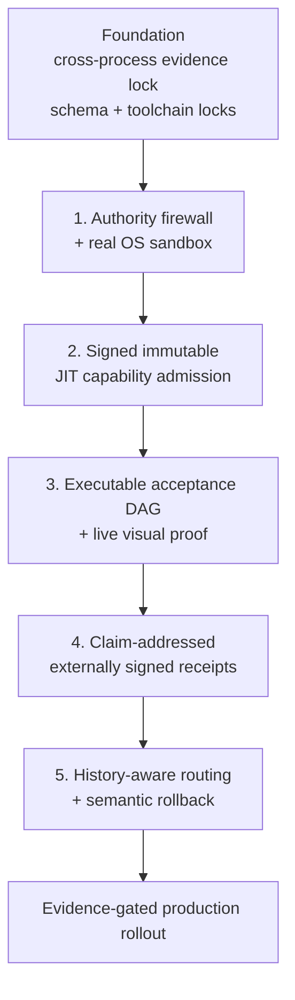

# HermesProof v0.9.2 release handoff and next-five program

**Handoff date:** 2026-08-12

**Requested operator email:** `fnice1971@gmail.com`

**Release branch:** `release/hp-mha-serena-shippable`

**Handoff base commit:** `ad16005ecb5a7255b368077c4640f649cab4648a`

**Local release worktree:** `C:\Users\Admin\Documents\Codex\2026-08-08\g-github-hermes3d-mcp-lock-orchestrator-2\work\hermesproof-release`

**GitLab:** <https://gitlab.com/Ghenghis/HermesProof>

**GitHub:** <https://github.com/Ghenghis/HermesProof>

> [!IMPORTANT]
> This is a documentation-only continuation handoff. Implementation stopped when the user requested “handoff now, no coding.” The five improvements in Part II are approved designs and implementation contracts; they are **not implemented in v0.9.2**. Do not describe them as shipped until their own tests, adversarial suites, proofs, and signed release gates pass.

## Executive status

The reconciled release branch contains the most current HermesProof implementation found across the audited local repositories. It includes the v0.9.2 stability fixes for HP-MHA, task/lease binding, durable automation authorization, Windows process spawning, Serena 1.7.0, Windows OTA, client snapshots, and signed distribution. Two ancestry-only merge commits now preserve the current GitLab and GitHub `main` histories without replacing the newer release implementation.

The branch is not yet a published stable v0.9.2 release. It must not be tagged or released until the remaining documentation/metadata corrections are made, the strict proof is regenerated at the final commit, a new archive is signed at that same commit, and the downloaded assets are independently verified.

Current remote relationship at handoff:

| Ref | Commit at audit | Relation to handoff base |
| --- | --- | --- |
| local release branch | `ad16005` | current handoff base |
| GitLab `main` | `dee988b` | ancestor after merge; local branch 13 commits ahead |
| GitHub `main` | `8b5ea93` | ancestor after merge; local branch 19 commits ahead |
| GitLab release branch | `dea112b` | local branch ahead |
| GitHub release branch | `c68ee36` | local branch ahead |

No force push, destructive reset, source-tree purge, secret readout, or release publication was performed during this handoff step.

```mermaid
flowchart LR
    A["Current release worktree\nad16005 + this handoff"] --> B["Correct docs and metadata"]
    B --> C["Local tests + two live MCP probes"]
    C --> D["Strict 37-gate proof"]
    D --> E["Build and Ed25519-sign final archive"]
    E --> F["Push release branch\nGitLab ci.skip + GitHub"]
    F --> G["Review and merge both remotes"]
    G --> H["Tag identical commit v0.9.2"]
    H --> I["Publish byte-identical assets"]
    I --> J["Download, verify, clean-install, probe"]
    J --> K["Promote stable OTA pointer"]
```



## Part I — v0.9.2 release continuation

### 1. Canonical shipped inventory

These are the current product facts. Keep their meanings separate:

| Surface | Exact count/status | Meaning |
| --- | --- | --- |
| `hermes3d-locks` | **121 tools** | Core coordination, locks, gates, evidence, agents, queues, GitLab, clients, diagnostics, and proof |
| `hp-mha-serena` | **34 tools** | Governed HP-MHA, Serena, capability, runtime, automation, Kilo backend, and updater surface |
| HermesProof total | **155 tools** | `121 + 34`; the two public HermesProof MCP servers |
| Serena upstream catalog | **52 tools** | Separate upstream inventory; do not add it to 155 |
| Serena desktop context | **29 active + 23 disabled/optional/backend-specific** | Context-dependent upstream dashboard count |
| Governed Serena selection | **15 semantic/LSP tools** | An overlapping policy subset used by the composite adapter |
| Raw Serena mutation exposure | **0 unrestricted** | Mutations must pass Hermes task, lock, source-hash, receipt, diagnostic, and rollback controls |

Serena is pinned to **v1.7.0**, immutable upstream commit `949a27ef1e5fda1a6e7b561e777bcece345c6ffd`, and the tracked project configuration uses `language_servers:`. The upstream desktop dashboard can correctly show 29 tools while HermesProof reports a 52-tool upstream catalog and a 34-tool composite server.

### 2. What is implemented

- Atomic task/file ownership, handoffs, TTL recovery, owner presence, queues, events, evidence, claim audits, bug tickets, and project contracts.
- A hash-chained evidence ledger and HP-MHA ledger with Merkle verification.
- A fail-closed HP-MHA smoke: invalid trace verification cannot print an end-to-end success marker.
- HP-MHA v2 measured-matrix binding: retained raw responses are loaded, cell-bound, re-scored, and digest-checked; a matrix cannot be silently assigned to an unrelated harness card.
- Public holdout enforcement that denies reserved holdout paths/tags, including `task-sets/holdout.json`, regardless of a caller-supplied role.
- Runtime leases bound to exact runtime, active lease, owner, workspace, task, permissions, and expiry.
- Scheduled automation that revalidates persisted owner/task/lease before execution and a kill switch that continues through individual cleanup failures.
- Windows-safe npm executable launching without an implicit command shell.
- Serena 1.7.0 semantic reads and guarded create/replace flows behind signed workspace handles and one-use source receipts.
- A two-entry local capability catalog, one pinned npm apply path, hashes, package-lock/integrity checks, SBOM generation, health probes, leases, and default-disabled lifecycle.
- Kilo Code RC25 backend doctor and minimal gap plan.
- LM Studio/LM Link preferred local inference with Ollama fallback.
- Client setup/snapshot/recovery coverage for Kilo Code, VS Code, Codex, Windsurf, LM Studio, Claude Desktop, Claude Code, Cursor, and Devin templates; Ollama is correctly treated as an inference route rather than an MCP host.
- Immutable updater staging, candidate quarantine, client-config restore, known-good pointer rollback, bounded scheduling, and cleanup path validation.
- Offline Ed25519 Windows ZIP signing and a standalone pre-extraction verifier.

### 3. Latest verified evidence

The latest retained strict proof is `truth_2026-08-12T22-12-31-035Z`:

- required gates: **37 pass, 0 fail**;
- warnings: **1** — LM Studio was offline (`ECONNREFUSED`); Ollama was healthy;
- skips: **1** — CodeRabbit had no PR context;
- Node tests inside the proof: **510 pass, 0 fail, 1 skip**;
- core stdio probe: **121 tools**;
- HP-MHA cards: **8 pass**;
- HP-MHA exact benchmark digest: `eb22b37ddd4aa8a64c46044b0fe485d7ec23bd38a06e0d10c7a28469f0f1d5a1`;
- holdout isolation cases: **5/5** expected decisions;
- proof report: [`../PROOF_E2E_REPORT.md`](../PROOF_E2E_REPORT.md);
- machine report: [`../PROOF/latest.json`](../PROOF/latest.json).

The proof predates the two ancestry-only merges at `08ffd15` and `ad16005`. Their trees merged cleanly without content changes, but a production release still requires a fresh proof at the final documentation/metadata commit. Evidence must follow the exact source commit, not merely an equivalent-looking tree.

An older signed v0.9.2 archive was clean-room installed successfully, but it was built from `dea112b` and is now stale. Its SHA-256 (`6cfed95ddba23de5c9c61e543b77facae866da04533cf117e293681956189c69`) is historical evidence only. **Do not publish it as the final v0.9.2 asset.**

### 4. Remaining v0.9.2 release blockers

These are narrowly scoped corrections, not permission to add more product features:

1. **Dual-remote documentation contract.** Several current files and tests say “GitLab only,” while the user now requires both remotes. The correct contract is:
   - GitLab is the authoritative OTA decision origin and GitLab Pages host.
   - GitHub is a synchronized source and signed-release mirror.
   - The source commit, annotated tag, archive bytes, `.sha256`, `.sig`, public key, verifier, manifest, SBOM, and proof must match across hosts.
   - GitHub never independently decides OTA currency.
2. **Canonical count invariants.** Add/derive and test `servers.totalTools = 155` and `serena.desktopDisabledTools = 23`; enforce `121 + 34 = 155` and `29 + 23 = 52`. The governed 15 is an overlapping subset.
3. **Public MCP version metadata.** `package.json` is 0.9.2, but the core initialize response still reports 0.7.0 and the composite/adapter reports 0.8.0. Derive public server version metadata from the canonical release version and assert it over real stdio.
4. **Security wording.** State that `owner`/`principal` is a caller-declared logical label bound into a signed workspace handle; stdio does not independently authenticate a Windows user, human, or network identity. Direct peer filesystem/shell MCP servers can bypass Hermes if a client invokes them outside the governed servers.
5. **CI truth.** Replace “auto-attested on push” claims with: `.gitlab-ci.yml` is ready for a tagged `hermesproof-local` owned runner; with zero usable GitLab compute minutes, v0.9.2 uses signed local proof and GitLab pushes with `ci.skip`. Do not start a shared-runner job.
6. **Documentation index/handoff links.** Link this handoff from README and the current release status, regenerate release facts, and update the Pages site without presenting any of Part II as shipped.

### 5. Known limitations that must remain explicit

- `sandbox_path` is a directory, **not an OS sandbox**. Capability children still run as the current OS user with that user’s filesystem/network authority.
- Owner strings are logically bound but are not independently authenticated principals.
- Runtime restart handling does not inventory and reconcile every orphaned native process.
- Durable automation desired state does not fully reconcile native scheduler orphans if its JSON state is lost.
- Capability publisher identity, Sigstore/DSSE verification, transparency evidence, live registry discovery, multi-format apply adapters, and executable pack rollback are not shipped.
- External OpenHands, Aider, and Goose harness cards are retained installed-reference declarations and are not live re-probed on every release.
- The generic claim-support heuristic is not exact claim-addressed provenance.
- Evidence append serialization is process-local; the two MCP processes do not yet share an OS-level single-writer lock.
- There is no separately owned evaluator result channel for HP-MHA.
- There is no general filesystem/process checkpoint or replay fence for arbitrary external effects.

### 6. Exact continuation commands

Use the isolated worktree only. Do not resume from the dirty July checkout.

```powershell
Set-Location 'C:\Users\Admin\Documents\Codex\2026-08-08\g-github-hermes3d-mcp-lock-orchestrator-2\work\hermesproof-release'
git status --short --branch
git log --oneline --decorate -15
git merge-base --is-ancestor gitlab/main HEAD
git merge-base --is-ancestor github/main HEAD
```

Before editing, use HermesProof itself:

```text
hermes_get_state
hermes_read_policy
hermes_doctor force_refresh=true
hermes_claim_task owner=codex-impl-01 taskId=HP-V092-FINALIZE
hermes_lock_files owner=codex-impl-01 files=[exact files]
```

After the six corrections above:

```powershell
npm ci
npm run docs:generate
npm run docs:check
npm run test:release-docs
npm run test:updater
npm test
node .\scripts\truth-gates.mjs --workspace .
git diff --check
git status --short
```

Require all of the following before building:

- clean worktree at the committed source;
- 121 core and 34 composite tools from real stdio `initialize` + `tools/list`;
- public server version 0.9.2 on both initialize responses;
- 155 total and Serena 52/29/23/15/0 invariants passing;
- 0 required truth-gate failures and no skipped required gate;
- HP-MHA real benchmark, Merkle, holdout, and provenance checks passing;
- documentation/site generated from the canonical facts;
- no secrets or private-key material in Git, proof, logs, or archive.

Build with the external key without printing it:

```powershell
$env:HERMESPROOF_RELEASE_SIGNING_KEY_FILE = 'C:\private\HermesProof-release-ed25519-private.pem'
npm run build:windows-release
npm run release:verify
node .\scripts\release-checksum.mjs --verify-sha256
Remove-Item Env:HERMESPROOF_RELEASE_SIGNING_KEY_FILE
```

Expected public-key fingerprint:

```text
sha256:9b1fb58db81fd4dceaef5b78a4aa83db6c57d70dbabddf2b4c1b12abcf1a92da
```

Push the reviewed release branch without force. Preserve GitLab’s compute balance:

```powershell
git push -o ci.skip gitlab release/hp-mha-serena-shippable
git push github release/hp-mha-serena-shippable
```

Review the existing GitLab MR and GitHub PR (or open replacements if closed). Merge without squashing the audited lineage. Then fetch and prove both `main` refs point to the identical final source commit before creating one annotated `v0.9.2` tag on that commit.

Publish byte-identical assets on both hosts:

- `HermesProof-v0.9.2-windows-x64.zip`
- `HermesProof-v0.9.2-windows-x64.zip.sha256`
- `HermesProof-v0.9.2-windows-x64.zip.sig`
- `hermesproof-release-ed25519-public.pem`
- `verify-hermesproof-release.mjs`
- `SHA256SUMS.txt`
- release manifest
- CycloneDX SBOM
- `PROOF/latest.json`
- `PROOF_E2E_REPORT.md`

Download each remote’s assets into separate empty directories. Verify each copy before extraction, compare SHA-256 across hosts, perform an isolated two-server install/smoke, then repair-install the managed Windows copy and confirm client snapshots/configurations remain intact.

### 7. Repository hygiene and storage

Do not purge broadly. The dirty source checkout `G:\Github\hermes3d-mcp-lock-orchestrator` remains an audit source and contains hundreds of untracked/vendored entries. A future cleanup must use:

1. exact approved roots;
2. source ownership markers;
3. rejection of links/junctions and nested Git repositories;
4. protection for source, current jobs, releases, proof, recovery snapshots, and `C:\private`;
5. a hash-bound dry-run manifest;
6. same-volume quarantine instead of immediate deletion;
7. revalidation before movement;
8. a 7–30 day retention window before a separately approved purge.

## Part II — five approved next-generation improvements

### Program boundary and dependency order

All five are post-v0.9.2 work. Deliver them as five separately reviewed branches/plans, with a cross-process evidence lock and schema/version helpers as the shared prerequisite.



Global rule: routing, model choice, tool descriptions, and historical success may **narrow** authority but can never create authority. All new enforcement begins in shadow mode, advances to new-capability enforcement, and reaches full enforcement only after platform-specific adversarial gates pass.

### Improvement 1 — Task-scoped authority firewall and real OS sandbox

**Status:** not implemented in v0.9.2.

**Gap.** Current leases and hashes govern Hermes-routed lifecycle operations, but child code runs as the current user. There is no universal call-time reference monitor across tool ID, typed arguments, paths, origins, credentials, task, lease, and runtime generation.

**Design.** Add one mandatory `CapabilityFirewall.authorize()` path for every effectful capability call, followed by a real sandbox adapter. A decision is call-specific and binds workspace handle/digest, owner, live task, lease, runtime generation, admitted artifact digest, exact tool, argument digest, requested/effective permissions, policy digest, and expiry. No generic `sandbox_exec` tool is exposed.

Default sandbox controls:

- network disabled; explicit policy-owned egress allowlists only;
- read-only root and workspace mounts;
- one bounded task output mount;
- non-root UID/GID, `cap-drop ALL`, no-new-privileges, seccomp/AppArmor where available;
- no host Docker socket, SSH agent, devices, browser profiles, credential folders, or home mount;
- 1 CPU, 512 MiB memory, 128 PIDs, 256 MiB tmpfs, 64 MiB output quota;
- five-minute idle TTL and 60-minute hard TTL;
- shutdown, terminate, force-kill, destroy, verify absence, then tombstone;
- restart reconciliation by namespace/workspace/lease/generation/artifact labels plus a random ownership nonce.

**Windows 11 setup.** Production-strength target is Windows 11 Pro/Enterprise with Docker Desktop’s Hyper-V Linux-container backend and, when licensed, Enhanced Container Isolation. WSL2 is development assurance only. Do not broadly share drives or enable unrelated distribution integration. The trusted HermesProof control process alone may access the Docker named pipe. Preflight must prove read-only mounts, resource/PID enforcement, network-none behavior, label ownership, and cleanup.

**Hostinger VPS setup.** Use a plain Ubuntu 24.04 LTS image, a dedicated least-privilege `hermesproof` account, Docker from its signed apt repository, rootless mode with cgroup v2/systemd enforcement, and optionally a pinned gVisor `runsc` runtime. Keep MCP/metrics on loopback or Unix sockets. Allow SSH only from operator networks through Hostinger and host firewalls. Do not assume nested virtualization/Firecracker without plan-specific proof.

**Research data.** These are upstream results, not promised HermesProof gains:

- [Progent](https://arxiv.org/abs/2504.11703): AgentDojo attack success **39.9% → 1.0%** and ASB **70.3% → 3.9%**; 6% of policy updates required approval.
- [CaMeL](https://arxiv.org/abs/2503.18813): **77%** AgentDojo completion versus **84%** undefended, with provable security properties.
- [Task Shield](https://aclanthology.org/2025.acl-long.1435/): **2.07%** attack success and **69.79%** utility in its evaluated setting.
- Engineering patterns: [OpenSandbox](https://github.com/opensandbox-group/OpenSandbox) lifecycle and [ToolHive permissions](https://github.com/stacklok/toolhive/blob/main/docs/arch/05-runconfig-and-permissions.md).

**Acceptance gates (HermesProof targets/inferences).** 100% of effectful handlers traverse the same authorization hook; at least 200 adversarial cases produce zero unauthorized effects and zero silent scope widening; at least 99% benign authorization classification; task success loses no more than five percentage points; no out-of-scope reads/writes, credential exposure, egress, or surviving descendants; shadow mismatch below 1% before enforcement.

### Improvement 2 — Signed immutable JIT capability admission

**Status:** not implemented in v0.9.2.

**Gap.** The current two-pack catalog is static and hash/integrity checked, but it does not authenticate publishers, verify Sigstore/DSSE identity, discover from a governed registry, or run every admitted package in an OS sandbox.

**Design.** Add `capability_find → admit → acquire → invoke → release`, backed by a content-addressed store. Registry metadata is discovery only. Admission requires exact version, immutable OCI/MCPB digest, expected signer identity and OIDC issuer, signature bundle/transparency proof, safe extraction, executable/tool-schema/SBOM hashes, declared permissions, sandboxed health probe, policy digest, and an admission receipt. Packs remain disabled until a task-scoped lease exists. Reject `latest`, semver ranges, mutable tags, arbitrary URLs, arbitrary registries, unsigned fallback, and generic code execution.

Initial artifact scope should be OCI and MCPB. Preserve the existing npm installer only as an explicitly trusted local-static compatibility path until equivalent provenance policy exists.

**Windows 11 setup.** Pin `cosign.exe` (audit baseline v3.0.6) by checksum/bundle in the managed toolchain directory, not workspace PATH. Invoke it with exact arguments and `shell:false`. Pull containers by digest through the improvement-1 sandbox. Rehash after promotion because antivirus can delay file operations.

**Hostinger VPS setup.** Keep the verified Cosign binary root-owned/readable by the HermesProof account. Use a narrow read-only registry credential helper or short-lived token. Never expose Docker over TCP. Store policy/trust roots outside workspaces, for example `/etc/hermesproof` or another root-owned directory.

**Upstream basis.** [Official MCP Registry API](https://github.com/modelcontextprotocol/registry/blob/main/docs/reference/api/official-registry-api.md), [Docker MCP Gateway v0.43.1](https://github.com/docker/mcp-gateway/releases/tag/v0.43.1), [Sigstore Cosign v3.0.6](https://github.com/sigstore/cosign/releases/tag/v3.0.6), and [Sigstore integration guidance](https://docs.sigstore.dev/cosign/system_config/integration/). These establish implementation patterns; no paper result is claimed as a local performance gain.

**Acceptance gates.** A valid signature from a wrong identity/issuer fails; no mutable reference reaches execution; traversal/symlink/device/case-collision/decompression-bomb archives fail; SBOM/schema/permission widening fails; crashes during download/stage/promote are transactional; a bad new version preserves the previous admitted digest; JIT acquisition produces an admission receipt, sandbox generation, scoped lease, and verified teardown.

### Improvement 3 — Executable acceptance DAG and live visual proof

**Status:** not implemented in v0.9.2.

**Gap.** The current queue is flat. It has ownership, priority, TTL, and states, but no first-class dependency graph, immutable root requirements, evidence predicates, critical path, or derived completion. The generic Playwright gate does not create a governed screenshot/ARIA/trace/video proof bundle.

**Design.** Introduce `acceptance-dag.v1` with immutable root requirements and fixed node types: allowlisted gate, visual recipe, artifact assertion, claim-receipt verification, manual approval, and cleanup. Reject cycles, missing dependencies, arbitrary commands, and required nodes depending on advisory nodes. A required failure/timeout/cancel blocks descendants. Completion is derived from current evidence rather than asserted by an agent.

The visual recipe uses a fixed action/assertion vocabulary and a signed, sandboxed Playwright image. A visual pass requires deterministic assertions plus a linked ARIA snapshot, screenshot, browser trace, console/network summaries, exact recipe/commit/browser digests, and bounded artifacts. No arbitrary page JavaScript or unsafe code tool.

**Windows 11 setup.** Run headless Chromium inside the Hyper-V sandbox using a signed/pinned Playwright MCP image (audited upstream baseline v0.0.79), an isolated profile, explicit origins, timeouts, quotas, and a dedicated allowlisted test endpoint. Do not use the operator’s signed-in browser profile.

**Hostinger VPS setup.** Put browser and target on a task-specific internal container network with no public target port. Enforce Chromium memory/shared-memory limits and sandbox teardown. Import secrets by one-run opaque reference and redact artifacts.

**Research data.** These support graph planning and long-running harness patterns; applying them to evidence-complete acceptance is an inference:

- [Plan-over-Graph](https://arxiv.org/abs/2502.14563): Claude success **89.5% → 93.5%**, optimality **14.5% → 41.5%**, time ratio **1.904 → 1.514**, and cost ratio **2.302 → 1.689** on 200 synthesized textual tasks.
- [DynTaskMAS](https://ojs.aaai.org/index.php/ICAPS/article/view/36130): **21–33%** lower execution time, utilization **65% → 88%**, and **3.47×** throughput with four times as many agents.
- [Atlassian HULA](https://www.atlassian.com/blog/atlassian-engineering/hula-blog-autodev-paper-human-in-the-loop-software-development-agents): 663 work items; 79% received plans, 82% of plans were approved, 25% reached PR, and 59% of produced PRs merged. Survey agreement that code solved the item was only 33%, showing why “work produced” is not equivalent to “done.”
- [Anthropic long-running harness guidance](https://www.anthropic.com/engineering/effective-harnesses-for-long-running-agents) supports feature lists, test-backed status, small increments, progress files, and version history without a controlled numeric causal result.

**Acceptance gates.** Zero tasks complete with a missing/failed/stale required sink; 100% node state reconstructs after restart; root weakening always needs approval and a receipt; premature completion is zero on at least 20 representative projects with no more than 10% makespan regression; machine status and user-visible progress never disagree; required visual nodes cannot pass without assertions and linked artifacts.

### Improvement 4 — Claim-addressed externally signed receipts

**Status:** not implemented in v0.9.2.

**Gap.** Current claim support can be satisfied by loose serialized/token overlap, and the evidence ledger is chained but not externally signed. Release ZIP signing authenticates an archive, not each claim/evidence decision.

**Design.** Canonically address the exact claim core (text/type, repository/commit/artifacts, acceptance contract, task) with SHA-256. Bind each claim to exact evidence entries, producing gates/turns, artifacts, and lineage; label the relationship direct observation, compression, or inference. Produce an in-toto Statement/DSSE receipt. A separate mediator/CI identity re-evaluates the digests and signs the receipt. HermesProof imports and verifies; there is deliberately no MCP `sign` tool and no signing key available to an agent process.

Before this work, add a cross-process atomic evidence append lock covering head read, `prev_hash`, append, flush, and release.

**Windows 11 setup.** Windows prepares and verifies only. A locally passing release remains `pending_external_signature`. A hash-pinned Cosign binary verifies the returned bundle against exact GitLab issuer/project/config/ref policy.

**Hostinger VPS setup.** The VPS verifier also holds no private signing key. A GitLab keyless CI job can sign using `SIGSTORE_ID_TOKEN` with `aud: sigstore`; a runner on the same VPS/user is not operationally independent and must be labeled lower assurance. NTP health is required.

**Research/data basis.** Provenance quality and receipt architecture are related but different:

- [TRACER](https://arxiv.org/abs/2605.09934) reports TRACE-Bench answer accuracy **78.23%**, summary accuracy **95.72%**, traceability **93.61%**, provenance F1 **90.52%**, 3,486 tool calls, and 573 tool errors. Tool-SFT recorded 70.94%, 84.39%, 4,949, and 590 respectively. These results do not prove signatures or semantic truth.
- Microsoft’s [Verifiable Compliance Receipts](https://microsoft.github.io/agent-governance-toolkit/proposals/verifiable-compliance-receipts/) proposes canonical input/result hashes, policy/authorization hashes, a previous-receipt hash, signer identity, and Ed25519/JCS. It is a proposal, not an empirical study.
- [in-toto Statement v1](https://github.com/in-toto/attestation/blob/main/spec/v1/statement.md), [DSSE](https://github.com/secure-systems-lab/dsse/blob/master/protocol.md), and [GitLab keyless signing](https://docs.gitlab.com/ci/yaml/signing_examples/) supply interoperable implementation patterns.

**Acceptance gates.** 100% of completion/test/security claims carry exact evidence IDs/hashes and current lineage; zero false support on a negative corpus of unrelated passing gates; 100% rejection of tamper/reorder/delete/substitute/stale-lineage/signer-substitution cases; Windows/Linux canonical bytes match; agent processes cannot access the signing key; receipt overhead no more than 5%; signatures are described as provenance/integrity, never semantic correctness.

### Improvement 5 — History-aware routing and semantic rollback

**Status:** not implemented in v0.9.2.

**Gap.** HermesProof has basic skill/reputation/provider-history dispatch, but no dynamic semantic tool-schema retrieval, call-time route permits, proof-only learning, router snapshots, or general recovery checkpoints. It is not yet proven that every client injects all 155 schemas, so routing should be measured before optimization.

**Design.** First collect baseline schema tokens, needed-tool recall, latency, success, and policy decisions. Then run a shadow deterministic/lexical top-k retriever with history-aware re-ranking and full-catalog fallback. Policy filters candidates before scoring. Only proof-backed outcomes affect production scoring. A route permit binds one owner/task/candidate/tool set/policy/catalog/history/index snapshot and is rechecked by the improvement-1 firewall.

Semantic rollback has two layers:

1. Atomically restore a known-good router policy/catalog/history/index snapshot and revoke permits/leases issued solely by the bad snapshot.
2. Add semantic work checkpoints only after recovery-relevant transitions; classify actions as pure, replayable, compensatable, or irreversible. Never claim that rollback silently undoes a deployment, message, payment, database write, or other external effect. Replaying past an irreversible effect requires an explicit fork and renewed approval.

**Windows 11 setup.** Start with pure-JavaScript lexical routing and content-addressed files—no new service. Optional embeddings must be a signed sandboxed capability with an exact model/image digest, preferably CPU in Hyper-V. Failure falls back to lexical mode and records degraded status. General process checkpointing is not claimed on Windows.

**Hostinger VPS setup.** Use lexical mode on smaller plans. Enable an internal-only signed embedding service only after CPU/memory reservations and a bounded startup test pass. Linux semantic checkpoint experimentation may use the research stack only in a separate program because eBPF/runc/ZFS/CRIU requirements are substantial.

**Research data.** These are upstream results and local thresholds must be measured:

- [MCP-Zero](https://arxiv.org/abs/2506.01056): 308 servers, 2,797 tools, about 248.1k tool-schema tokens, and **98%** token reduction on APIBank while retaining high reported accuracy. HermesProof must not assume that reduction at a 155-tool scale.
- [ACE-Router](https://aclanthology.org/2026.acl-long.281/): MCP-Universe **53.44±0.57** versus GPT-4o 47.41, Gemini 49.79, and Claude Sonnet 4 48.25; MCP-Mark easy 60 versus 38/46/44. Removing history reduced rounded scores 53→48 and 60→52; agent-routing accuracy was 91.67%.
- [SWE-Skills-Bench](https://arxiv.org/abs/2603.15401): 39 of 49 skills showed no pass improvement, mean improvement was about 1.2%, token overhead reached 451%, and three skills harmed results—evidence against enabling every skill/tool by default.
- [Crab](https://arxiv.org/abs/2604.28138): more than 75% of turns had no recovery-relevant state; Terminal-Bench recovery was 8–13% with chat, 28–42% with chat+filesystem, and 100% with Crab. It reduced checkpoint work/traffic up to 87%, stayed within 1.9% of fault-free time, and cut rollback wall time up to 29% and tokens 36%. Its Linux stack does not directly transfer to Windows.
- [ACRFence](https://arxiv.org/abs/2603.20625) identifies replay and authority-resurrection risks and proposes irreversible-effect fencing; no quantitative production result was verified.

**Acceptance gates.** Do not leave shadow mode unless baseline shows material schema cost. Needed-tool top-k recall at least 99%; task success no more than one percentage point below full-catalog mode; at least 30% schema-token reduction; p95 routing below 100 ms; fallback below 5%; zero policy-invalid exposure. For rollback: at least 99% recovery across 100 injected failures in supported domains, zero evidence loss, duplicated irreversible effects, or authority resurrection, exact restoration of declared local invariants, no more than 5% normal-run overhead, and at most 2–3 automated repair attempts before a visible blocked state.

## Part III — delivery plan for the next operator

### Workstream 0 — finish and publish v0.9.2

Only the six blockers in Part I. Do not start next-five implementation on the release branch.

### Workstream 1 — shared foundation

- cross-process evidence append lock;
- common schema/version helpers;
- content-addressed policy/toolchain lock;
- bounded metrics without task/owner/URL/argument labels;
- fault/adversarial baseline corpus;
- shadow/enforce-new/enforce-all feature modes.

### Workstreams 2–6

Create one branch and plan per improvement. Each plan must specify exact files, red tests first, implementation tasks, Windows/VPS matrix, migration, rollback, documentation, and release evidence. Recommended order:

1. claim-addressed evidence schema plus authority shadow instrumentation;
2. enforce the firewall and platform sandbox;
3. signed JIT admission;
4. executable acceptance DAG and visual proof;
5. external receipts;
6. semantic checkpoints and routing only after baseline data justifies routing.

### Definition of done for the full program

The program is complete only when:

- an untrusted test MCP cannot read/write/egress outside policy or survive hard expiry;
- restart reconciliation removes a verified orphan safely;
- a valid signature from the wrong identity fails;
- no mutable artifact reference reaches execution;
- required DAG failure blocks descendants and completion;
- visual pass has assertions, ARIA, image/trace hashes, and commit binding;
- claim IDs match across Windows and Linux;
- an exact GitLab identity signs receipts and mismatches fail;
- routing filters by policy before scoring and learns only from proof;
- hidden tools remain uncallable even when semantically relevant;
- rollback restores a known-good route snapshot without claiming to reverse external side effects;
- Windows Hyper-V and Hostinger rootless/gVisor suites report their distinct assurance tiers;
- all v0.9.2 compatibility, tests, MCP probes, proof, installer, updater, and signed-archive gates remain green;
- documentation clearly labels shipped, degraded, experimental, and planned paths.

## Four-agent audit provenance

This handoff combines four independent lanes:

1. primary release/repository audit and remote ancestry reconciliation;
2. repository gap/security/documentation audit;
3. capability/sandbox/JIT/platform setup contract;
4. primary-source paper/pattern review with limitations and proposed local thresholds.

Subagents performed read-only work. No research result was automatically converted into product code. Numbers above retain their source context and are not forecasts for HermesProof.

## Final operator warning

Do not call v0.9.2 released because this handoff exists. A release claim becomes true only after the final exact commit is locally re-proved, rebuilt, externally downloadable, signature-verified, clean-installed, two-server-probed, mirrored byte-for-byte, and recorded in both release pages. Until then, the accurate status is:

> **The implementation is substantially complete and locally proven at the prior content state; publication and final commit-bound attestation remain pending.**
