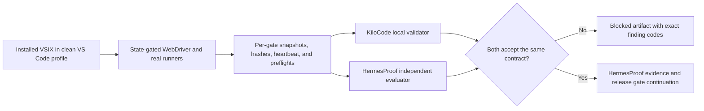
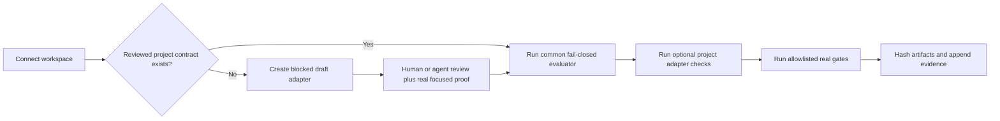
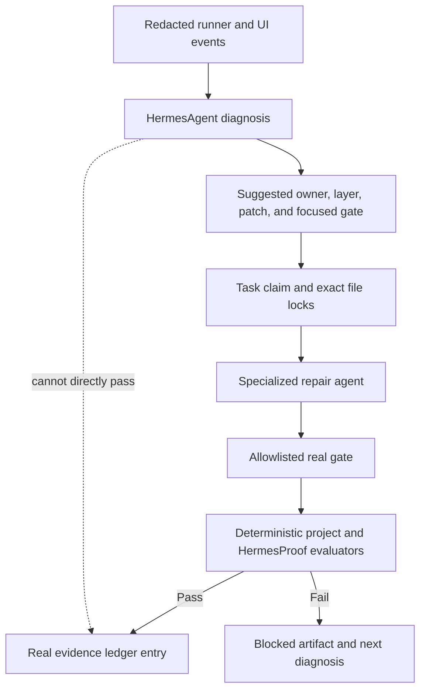

# KiloCode + OpenHands + HermesProof

HermesProof is KiloCode's fail-closed policy, coordination, and proof evaluator. KiloCode remains the primary UX and runtime; OpenHands, Aider, and Goose perform real delegated work; HermesProof rejects unsupported completion or release claims and records hash-chained evidence.

HermesProof does not replace KiloCode's runners or VS Code UI driver. It can accept or reject their structured evidence, report the exact failing layer, coordinate file ownership, and preserve proof lineage. It cannot turn a structural check, command registration, HTTP 200, or generated `ev_*` text into a real pass.

## Synchronized E2E Contract

KiloCode and HermesProof share contract version `kilocode.e2e-proof-contract.2026-07-10`.

The KiloCode sources of truth are:

- `ci/e2e-gate-proof-policy.json` for machine-readable gates and required preflights.
- `ci/validate-e2e-proof.mjs` for local release validation.
- `docs/current-e2e-recovery-contract-2026-07-10.md` for the current operational workflow and truthful status.
- `docs/real-e2e-proof-governance.md` for anti-fake release rules.

The HermesProof sources of truth are:

- `src/core/kilocode-integration.mjs` for the independent fail-closed evaluator.
- `src/core/kilocode-integration.test.mjs` for parity and rejection coverage.
- `hermes_kilocode_evaluate_installed_vsix_release_proof` for installed release evaluation.
- `hermes_kilocode_evaluate_roadmap_completion_proof` for action-plan and roadmap completion evaluation.

Any contract-version or required-preflight change must update both repositories in the same recovery batch. Until both focused test suites pass, release proof is blocked.



Required preflights cover dirty-workspace classification, visible UI and Settings drivers, Settings/Speech/Lanes behavior, migration dismissal, chat focus/submission/routing, real sidecar routes/runners/transport, HermesProof connectivity, artifact audit, Gates 11-21 planning, and roadmap proof. Each must be present and `ok`; nested mock, fake, stub, simulated, skipped, or UI-only metadata is rejected.

## Generic Project Connector And Adapter Target

KiloCode is the first deep adapter, not the only supported project. The project-agnostic design is:

1. `hermes_connect_project` binds an existing workspace and records its repository identity without changing project code.
2. HermesProof loads `.hermesproof/project-contract.json` when present.
3. If no contract exists, a scaffold command may create a draft manifest. Draft status is always blocked and cannot authorize release claims.
4. The manifest names allowlisted gate IDs, runner classes, required preflights, artifact/hash rules, redaction rules, release-claim vocabulary, and optional adapter module.
5. A generic evaluator validates the common envelope. A project adapter can add deeper checks but cannot weaken common anti-fake, secret, hash, evidence-lineage, or fail-closed rules.
6. Every adapter ships rejection tests, one real focused acceptance fixture, version migration rules, and documentation links.

The intended manifest shape is:

```json
{
  "schema": "hermesproof.project-contract.v1",
  "projectId": "example-project",
  "contractVersion": "example-project.e2e.2026-07-10",
  "releaseGateId": "project-release",
  "requiredPreflights": ["dirty-workspace", "runner-readiness", "artifact-audit"],
  "allowedRunnerClasses": ["installed-app", "browser", "cli", "external-runner"],
  "requiredArtifactFields": ["path", "sha256", "runId"],
  "evidenceRequired": true,
  "redactionPolicy": "strict",
  "adapter": "./.hermesproof/adapter.mjs"
}
```

The adapter is data validation, not an unrestricted shell hook. Commands execute only through HermesProof's gate allowlist. A connector or scaffold is never proof that the project works.



## HermesAgent Automation Boundary

HermesAgent may sit above the deterministic connector/evaluator layer and use an approved model such as MiniMax M3 for:

- redacted log and event-timeline diagnosis;
- matching a failure to its responsible layer;
- proposing the next smallest focused gate;
- researching official documentation and primary source after repeated failure;
- scaffolding a draft project contract or adapter;
- coordinating specialized repair, review, and verification agents.

HermesAgent must not:

- mark a gate passed or generate an `ev_*` id;
- weaken required preflights, artifact hashes, redaction, or release rules;
- execute arbitrary manifest commands outside the allowlisted gate runner;
- read or return raw private configuration, tokens, prompts, private paths, or audio;
- replace runner output, UI events, snapshots, or deterministic validators with a model conclusion.

The model API key is resolved only from approved private configuration. Model input is redacted before dispatch, and model output is treated as an untrusted recommendation until a real focused runner proves it.

## Hybrid HermesAgent And ZeroClaw Workers

HermesAgent and ZeroClaw solve different parts of the same recovery loop. HermesAgent is the project-aware diagnosis, research, planning, review, and proof-coordination role. ZeroClaw is the durable execution host for bounded local or VPS work. HermesProof owns locks, policy, evidence, and the decision to accept or block a result.

MiniMax M3 is the deterministic HermesAgent primary model. DeepSeek is the default fallback. Any other provider is opt-in and must be named in `HERMES_AGENT_FAILOVER`; performance scoring may record outcomes but must not silently reorder the primary path.

A helper result uses `hermesproof.helper-runtime.v1` and must include a shared run id, worker id/runtime/location, commit, VSIX SHA-256, timestamp pair, bounded scope, terminal runner status, artifact hashes, `secretValuesReturned: false`, and an existing `ev_*` evidence id for completed work. HermesProof rejects fake metadata, secret signals, missing evidence, timeouts, bad exit codes, incomplete artifacts, and local/VPS lineage mismatches.

For a gate that requires both locations, the local and VPS envelopes must share the exact run id, commit, and VSIX hash while retaining distinct worker identities. A local Windows/VS Code result cannot be substituted with a VPS status check, and a VPS soak/container result cannot be substituted with local UI evidence.



### Project Awareness And Continuous Research

For HermesAgent to be useful across a real codebase, the connector should build a provenance-aware project context rather than send the whole repository to a model. The context has these inputs:

- repository identity, branch, commit, worktree status, ownership, and file locks;
- project contract, architecture docs, current action plan, roadmap, and handoff;
- language/package graph, entry points, tests, runners, schemas, and release commands;
- recent structured failures, stage events, stack traces, blocked artifacts, and prior repair attempts;
- source links from official documentation, standards, research papers, and primary upstream repositories;
- a finding register with status, confidence, affected files, supporting source, supersession, and proof result.

Indexing must preserve source, path, commit or URL, retrieval time, and content hash. Model summaries are derived notes, never replacements for the original source. Private files are excluded unless an explicit policy grants a narrow redacted read; raw secrets never enter embeddings, prompts, logs, or evidence.

The automated research loop is:

1. Receive a structured blocker or audit question.
2. Retrieve the smallest relevant local code/docs/tests and prior findings.
3. Inspect local authoritative schemas and logs first.
4. Search official documentation, standards, papers, or primary repositories when the contract is unclear or the same layer failed three times.
5. Produce a cited diagnosis with competing hypotheses, confidence, affected layer, and smallest falsifying test.
6. Claim a task and exact files before edits.
7. Dispatch a specialized repair agent, independent reviewer, and verifier when risk warrants it.
8. Run an allowlisted focused gate and attach the result to the finding.
9. Mark the finding confirmed, rejected, superseded, or still blocked. Never silently erase failed hypotheses.

Useful HermesAgent roles are intentionally narrow:

| Role | Best use | Required output |
|---|---|---|
| Triage | Classify failure layer and urgency | Safe blocker code, owner, next smallest test. |
| Research | Compare local behavior with official or primary sources | URLs, retrieval times, source hashes, applicability notes. |
| Auditor | Review architecture, security, docs/code drift, and proof bypasses | Findings with file/line evidence and severity. |
| Repair | Patch the diagnosed layer only | Locked-file diff and focused test request. |
| Reviewer | Challenge assumptions and regression risk | Independent accept/reject findings. |
| Verifier | Run deterministic gates and artifact checks | Real status, duration, hashes, and evidence references. |
| Maintainer | Update contracts, docs, diagrams, and supersession links | Parity result and current-truth references. |

Long-running research and isolated tools may execute on a VPS worker. The authoritative contract registry, lock state, evidence ledger, private configuration boundary, and local VS Code UI proof remain with the workspace coordinator. Remote results must return a run ID, runner identity, source provenance, timestamps, hashes, and redacted status before HermesProof considers them.

### Contract-Backed Skills

A reusable HermesProof skill should declare:

- purpose, applicability signals, required inputs, and explicit non-goals;
- allowed tools, runner classes, network policy, and file/path scope;
- expected structured output and affected/related-file discovery rules;
- required review level, focused gate, artifacts, hashes, and evidence class;
- private-data policy, redaction rules, timeout stages, retry limit, and escalation rule;
- version, primary-source links, compatibility range, and migration notes.

The highest-value initial skills are:

| Skill | Value | Deterministic completion rule |
|---|---|---|
| Project bootstrap | Creates repo map, contract draft, architecture decision log, test topology, and release path | Contract validates; no release claim. |
| Architecture review | Finds ownership, coupling, missing boundaries, and failure modes | Findings cite local files and are independently reviewed. |
| Feature impact | Maps requested behavior to code, tests, docs, schemas, UI, migrations, and rollback | Every affected surface is classified or explicitly excluded. |
| Debugging | Converts logs/events into ranked hypotheses and smallest tests | A hypothesis closes only after a focused test confirms or rejects it. |
| Test architect | Chooses unit, integration, installed UI, external runner, and release proof tiers | Tests execute real implementation at the declared tier. |
| Security/privacy | Audits secrets, trust boundaries, permissions, dependencies, and artifact leakage | Scanner/review findings plus safe regression gates. |
| UX workflow | Audits real user journeys, state transitions, accessibility, and failure recovery | Visible interaction proof with state-based assertions. |
| Docs/code parity | Compares contracts, diagrams, commands, schemas, and implementation | Drift list is empty or explicitly blocked with owners. |
| Upstream/dependency | Checks official releases, migration notes, APIs, and compatibility | Sources are primary and version-bound; upgrades run focused gates. |
| Release recovery | Classifies dirty work, preserves changes, builds artifacts, and runs release gates | One versioned proof bundle accepted by project and HermesProof evaluators. |

Idea generation is advisory. HermesAgent may propose improvements only when each idea includes the user goal served, affected surfaces, expected benefit, implementation cost, risk, proof plan, and reason it belongs now. Ideas that do not improve an active goal remain in a non-executing backlog and cannot expand scope automatically.

## Release Evaluation Order

1. Run focused installed-VSIX proof for the broken surface.
2. Preserve a failed or blocked artifact; never relabel it as a warning pass.
3. After three failures at the same layer, inspect local source and logs, then official documentation or the primary upstream source. Record source links in the blocker.
4. Patch only the identified layer and rerun the smallest focused proof.
5. Run KiloCode's release validator.
6. Submit the same structured artifact to `hermes_kilocode_evaluate_installed_vsix_release_proof`.
7. Continue only when both evaluators accept the same contract version and evidence.

Focused proof remains `releaseEligible: false`. Stable, final, all-gates, and 21/21 claims require KiloCode's strict release command to pass.

## Contract

KiloCode should call the tools in this order:

1. `hermes_kilocode_status`
   - Read redacted readiness.
   - Rank providers for `kilocode_openhands_delegation`.
   - Read current project guardrails and visual progress checkpoint intervals.
   - Confirm `secret_values_returned` is `false`.

2. `hermes_kilocode_set_guardrails`
   - Use this when starting a project, recovering scattered work, or switching into a milestone-driven completion pass.
   - Guardrails are real controls: they can require visual proof, block new scope until the current milestone is usable, shorten checkpoints in `hyperfocus_visual_mode`, and return concrete next actions.
   - The tool stores only booleans, intervals, and a redacted reason in the active workspace.

3. `hermes_kilocode_policy_check`
   - Send a short summary, trigger, risk, repeated failure count, and needed capabilities.
   - Delegate only when `delegate` is `true`.
   - Treat `decision: "ask"` as a permission boundary.
   - Treat `decision: "deny"` as a hard stop until the caller resolves the returned `required_actions`, marks the milestone usable, or replaces raw secrets with named secret references.

4. `hermes_kilocode_checkpoint_progress`
   - Record real milestone progress before claiming completion.
   - If visual proof paths are supplied, HermesProof checks that the files exist before writing checkpoint/evidence state.
   - Use status `usable`, `verified`, or `complete` only after a runnable UI, passing gate, or concrete smoke result exists.

5. OpenHands sidecar execution
   - Keep secrets out of prompts and logs.
   - Prefer named secret references and OpenHands secret injection.
   - Keep high-risk actions such as SSH, deploys, package installs, and destructive edits behind explicit permissions.

6. `hermes_kilocode_record_delegation`
   - Record a redacted summary, result, latency, provider id, model id, permission decision, and proof reference.
   - Use outcome `verified` only when an actual smoke test or gate passed.

## Project Guardrails

Guardrails are meant to help KiloCode create and finish usable projects. They are not labels for the user. The main controls are:

- `mvp_first`: ship the smallest usable milestone before expanding scope.
- `force_mvp_gui_first`: make the first UI/navigation path runnable early when a project has a GUI.
- `require_visual_proof`: require screenshot or visible-state proof for GUI-facing progress.
- `screenshot_on_checkpoint`: capture visual state at checkpoints when a GUI exists.
- `block_until_usable`: block new scope until the current milestone is usable or deliberately overridden.
- `focus_mode`: keep the active task narrow until the current checkpoint is resolved.
- `hyperfocus_visual_mode`: shorten checkpoint intervals and make visual proof more frequent while work is moving fast.

Policy responses include `guardrail_goals`, `required_actions`, `visual_proof_required`, `blocked_by_guardrails`, and checkpoint timing. KiloCode should display or act on those fields instead of continuing blindly.

## Escalation Triggers

Use OpenHands when KiloCode hits one of these conditions:

- `missing_tool`: Kilo lacks a terminal, browser, SSH, Docker, or install capability required for the task.
- `repeated_failure`: Kilo fails the same tool or setup layer three times and the blocker includes local diagnosis plus official or primary-source research.
- `ssh` or `vps`: remote shell work is needed.
- `browser`: authenticated or dynamic browser work is needed.
- `docker`: containerized sandboxing or image work is needed.
- `install`: package or system dependency setup is needed.
- `deploy`: deployment or environment publishing is needed.
- `long_running` or `stuck`: the task needs a durable sidecar loop.
- `explicit`: the user requested OpenHands.

Do not delegate simple local edits or read-only inspection unless failures repeat or the user explicitly asks.

## Privacy Rules

- Never place API keys, access tokens, passwords, private keys, private file contents, or private root paths in KiloCode prompts, OpenHands messages, HermesProof tool inputs, speech, logs, commits, or docs.
- Use environment variables or named secret references for credentials.
- Redact before recording evidence.
- Store only summaries, proof references, provider ids, model ids, task ids, and permission decisions.

## Permission Defaults

HermesProof returns `required_permissions` for KiloCode to map into its own permission UI:

- `openhands_delegate`
- `openhands_workspace_write`
- `openhands_external_network`
- `openhands_browser`
- `openhands_docker`
- `openhands_install`
- `openhands_ssh`
- `openhands_deploy`
- `openhands_destructive`
- `openhands_secret_access`

`openhands_secret_access` should not mean "send the secret to the model." It should mean "the sidecar may resolve an approved named secret through a safe secret-injection path."

## OpenHands Delegation Smoke

A minimum end-to-end proof should show:

1. KiloCode asks HermesProof for status and provider ranking.
2. KiloCode sets or reads project guardrails and receives an `ask` or `allow` policy decision for a non-secret task.
3. KiloCode checkpoints real progress with `hermes_kilocode_checkpoint_progress`, including an existing proof file when visual proof is claimed.
4. KiloCode starts or contacts OpenHands and completes a small terminal-backed setup.
5. KiloCode records the result with `hermes_kilocode_record_delegation`.
6. `hermes_provider_stats` shows the `kilocode_openhands_delegation` event.
7. `hermes_verify_evidence` reports a valid evidence chain.
