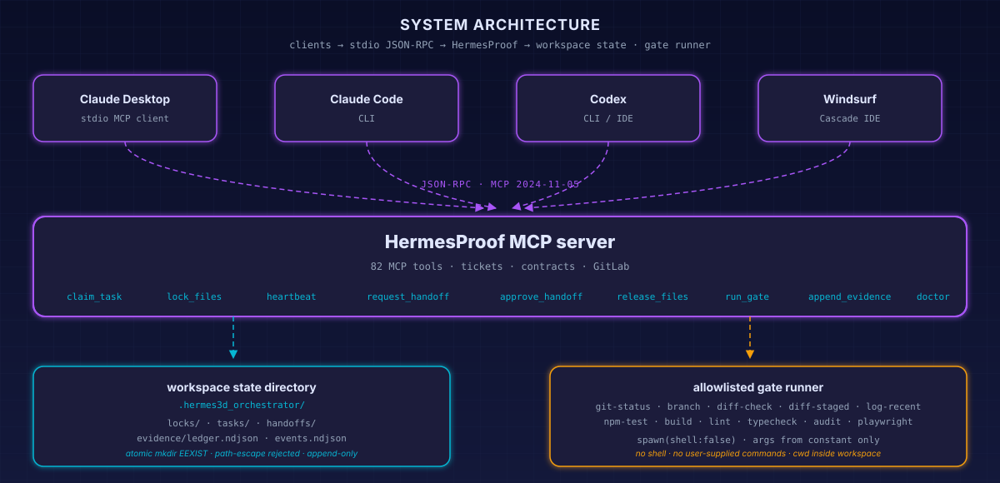

# HermesProof — Security Policy

> v0.9.2 includes a fail-closed managed updater, hash-guarded client snapshots,
> integrity-pinned capability-pack policy, and a second governed MCP server. See
> [UPDATER_RUNBOOK.md](UPDATER_RUNBOOK.md) for the activation contract.

This MCP is intentionally narrow. Everything the server is allowed to do is enumerated in this document.

<div align="center">

</div>

## Threat model in one diagram

The two surfaces an attacker (or a buggy agent) might target are the **state directory** and the **gate runner**. Both are kept small on purpose.

## Offline release-signing boundary

Official Windows ZIPs are signed with Ed25519 after their internal manifest is built and verified. The private key is stored outside every repository at `C:\private\HermesProof-release-ed25519-private.pem`, with Windows inheritance removed and access limited to the current user. It is never placed in a release archive, manifest, SBOM, proof file, updater evidence, client configuration, or GitLab variable.

The reviewed trust anchor is `config/hermesproof-release-ed25519-public.pem`. The official builder derives the public key from the supplied private key and fails if it differs from that pinned key. It emits exact `.zip.sha256` and `.zip.sig` sidecars, then immediately performs the same cryptographic verification required of downloaded releases.

The standalone verifier binds five values: signature schema, Ed25519 algorithm, exact archive basename, recomputed SHA-256, and public-key fingerprint. Malformed or extra envelope fields, renamed archives, altered bytes, malformed checksums, wrong public keys, and modified signatures all fail closed.

Trust begins with the public key in a reviewed GitLab source revision. Key rotation requires a reviewed public-key commit, a transition release note with both fingerprints, and preservation of old public keys for historical verification. Sigstore and Authenticode are not claimed by this ZIP release.

## Allowed

- Lock files.
- Release files.
- Request handoffs.
- Approve/deny handoffs.
- Append evidence.
- Run named gates from an allowlist.

## Not allowed

- Arbitrary or client-supplied shell execution. Reviewed gates and bounded exact-argument process adapters are permitted only for declared capabilities.
- Arbitrary file writing through MCP.
- Editing files without locks.
- Force unlocking active locks.
- Committing to main/master.
- Sharing API keys through evidence data.

## Gate allowlist

Current built-in gates (all read-only or workspace-scoped):

```text
git-status          # show changed files
git-branch          # show current branch
git-diff-check      # detect whitespace + merge-conflict markers
git-diff-staged     # summary of staged changes
git-log-recent      # last 10 commits
npm-test
npm-build
npm-lint
npm-typecheck
npm-audit           # `npm audit --audit-level=high`
playwright
```

Add gates only by editing `src/core/gate-runner.mjs` and documenting the reason. The gate runner rejects unknown ids, refuses `cwd` values that escape the workspace, and surfaces ENOENT spawn failures with a clear hint.

## Path safety

The lock manager rejects paths that escape the resolved workspace root (`MCP_LOCK_WORKSPACE`, falling back to `HERMES3D_WORKSPACE`, then `process.cwd()`). The error message includes the requested path, the resolved absolute path, and the workspace root for fast debugging. Use workspace-relative paths whenever possible.

## Stale locks

Locks have TTLs. Recovery is manual and evidence-backed through `hermes_recover_stale_locks`. This prevents silent lock stealing.

## Secret-leak prevention

HermesProof v0.6 hardens the repo against the `.env.txt`-family of footguns that bypass standard `.env` ignore patterns. A defense-in-depth combo of a hardened `.gitignore`, a project-local `.gitleaks.toml` rule set covering providers GitHub does not natively scan (Anthropic, DeepSeek, Hugging Face, SiliconFlow, MiniMax, CodeRabbit), and an opt-in `.githooks/pre-commit` hook runs `gitleaks protect --staged` before every commit. Contributors enable the hook with `git config core.hooksPath .githooks`; once enabled, the hook fails closed when `gitleaks` is not installed so secret scanning cannot silently become a no-op.

- `.gitleaks.toml` — provider rule set + allowlist for synthetic fixtures (`sk-ant-test-*`), `*.example` paths, and `node_modules/`.
- `.githooks/pre-commit` — staged-diff secret scan; blocks commits when `gitleaks` is absent until the hook is disabled or the binary is installed.
- `.gitignore` — explicit deny for `.env.txt`, `.env.bak`, `.env.old`, `.env.swp`, `.env~`, `.env.deploy`, `.env2`, `.env.production`, `.env.staging`, `.env.vps`, and the catch-all `*.env`, with allowlisted `*.example` siblings.
