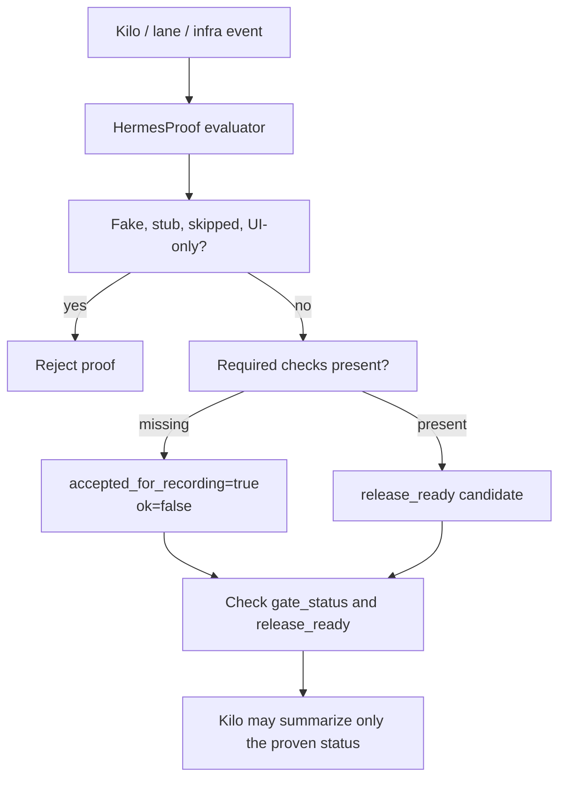

# HermesProof Staleness Audit - 2026-07-05

This audit separates current HermesProof/Kilo enforcement truth from older HermesProof and Hermes3D planning artifacts. It also lists false-positive risks that could block useful work or make partial proof look stronger than it is.

## Current Source Of Truth

For the Kilo ecosystem handoff, read the Kilo-side truth files first:

- `G:\Github\kilocode-2026-openhands\TRUE_MAP.md`
- `G:\Github\kilocode-2026-openhands\HANDOFF.md`
- `G:\Github\kilocode-2026-openhands\docs\hermesproof-handoff-index.md`
- `G:\Github\kilocode-2026-openhands\docs\MASTER_ECOSYSTEM_DIAGRAM.md`

For HermesProof repo-local behavior, use these files as current references:

- `README.md`
- `PROOF_E2E_REPORT.md`
- `docs/ARCHITECTURE.md`
- `docs/TOOL_REFERENCE.md`
- `docs/ACCEPTANCE_GATES.md`
- `docs/KILOCODE_OPENHANDS_INTEGRATION.md`
- `docs/HERMES_AGENT_ENABLE.md`
- `docs/RUNTIME_BACKEND_BRIDGE_GAP_AUDIT.md`
- `src/core/kilocode-integration.mjs`
- `scripts/anti-slop-realness-gate.test.mjs`

## Historical Or Superseded Root Docs

| File | Status | Why |
| --- | --- | --- |
| `FINAL_EVIDENCE_REPORT.md` | Historical | May 2026 v0.3.0 closure report; not current Kilo ecosystem state. |
| `Missing-Features.md` | Historical/reference | May 2026 feature inventory; current Kilo lanes changed the scope. |
| `CONTINUATION_CLAUDE.md` | Historical | Pre-reboot May continuation state; includes old authorizations and workspace assumptions. |
| `CONTINUATION_CODEX.md` | Historical | Pre-reboot May continuation state; not current handoff. |
| `CODEX_NEXT_PROMPTS.md` | Historical Hermes3D GUI prompt pack | Useful only for old Hermes3D GUI context, not current HermesProof/Kilo. |

These files should not be used to decide whether current Kilo/OpenHands/Aider/Goose lanes are complete.

## Enforcement And False-Positive Audit

| Component | Current behavior | False-positive risk | Required handling |
| --- | --- | --- | --- |
| Kilo policy check | Classifies local, OpenHands, SSH/VPS, destructive, deploy, secret, and scope-change actions. | `block_until_usable` can treat a necessary blocker repair as new scope if the action is labeled poorly. | Mark blocker repairs as current-milestone remediation; reserve `scope_change=true` for actual new work. |
| HermesProof strict mode | Can fail closed when HermesProof is unavailable. | Useful work can be blocked if strict mode is enabled before MCP availability is stable. | Use advisory/enforced during integration; strict only after visible Kilo MCP routing is proven. |
| Infrastructure proof gate | Rejects fake/stub/UI-only checks and computes `release_ready`. | Older code let partial proof look like `ok:true` if it was merely recordable. | Current code splits `ok` from `accepted_for_recording`; consumers must still check `gate_status` and `release_ready`. |
| Agent bus proof | Rejects fake/stub/skipped/UI-only events and requires `ev_*` for `task.completed`. | A dashboard could show "done" while HermesProof rejects completion. | Completion authority must remain HermesProof evidence, not external chat or dashboard labels. |
| Anti-slop keyword checks | Rejects pass-shaped fake/stub/mock/skipped claims. | If a status field itself contains those words in explanatory prose, a legitimate diagnostic can be rejected. | Keep status fields controlled (`pass`, `fail`, `warn`, etc.); put explanation in summary/evidence fields. |

## Proof Commands

Run these after changing HermesProof enforcement or Kilo integration:

```powershell
cd G:\Github\hermes3d-mcp-lock-orchestrator
node scripts\truth-gates.mjs
node --test scripts\anti-slop-realness-gate.test.mjs
node scripts\v07-stdio-roundtrip-smoke-test.mjs
```

Run these Kilo-side checks after changing provider/lane status:

```powershell
cd G:\Github\kilocode-2026-openhands\packages\opencode
bun test test\kilocode\hermesproof-enforcement.test.ts test\kilocode\realness-gates.test.ts test\kilocode\goose test\kilocode\aider test\kilocode\openhands
bun run typecheck
```

## Interpretation Diagram



## Current Audit Conclusion

HermesProof is not too restricted by design, because the intended Kilo integration has advisory/enforced/strict modes and structured proof statuses. The real risk is misconfiguration or misinterpretation: strict mode before MCP availability, treating accepted partial evidence as release-ready, or classifying current-milestone repairs as scope creep. Those are now documented as handoff risks.

## Verification From This Audit Pass

Commands run during this staleness pass:

```powershell
cd G:\Github\hermes3d-mcp-lock-orchestrator
node --test src\core\kilocode-integration.test.mjs scripts\anti-slop-realness-gate.test.mjs
node scripts\v07-stdio-roundtrip-smoke-test.mjs
node scripts\truth-gates.mjs
```

Results:

- KiloCode/HermesProof integration plus anti-slop tests: 15 pass, 0 fail.
- Stdio MCP round-trip: 21 pass, 0 fail.
- Truth gates: 35 pass, 1 fail, 1 skip. The single fail is `workspace.integrity` because the repo is actively dirty during this audit; that correctly blocks release-ready claims until the worktree is staged/committed, cleaned, or captured by an expected-diff manifest.
