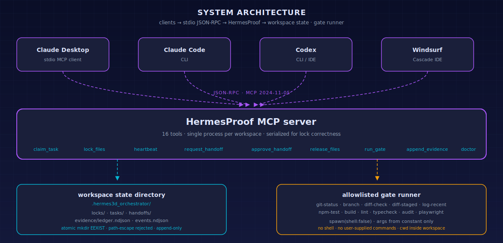

# HermesProof — Tool Reference

The server exposes 15 MCP tools across coordination, gates, evidence, and diagnostics.

<div align="center">

</div>

| Group           | Tools                                                                                                        |
| --------------- | ------------------------------------------------------------------------------------------------------------ |
| Claim / release | `hermes_claim_task`, `hermes_release_task`                                                                   |
| Lock            | `hermes_lock_files`, `hermes_release_files`, `hermes_heartbeat`                                              |
| Handoff         | `hermes_request_handoff`, `hermes_approve_handoff`                                                           |
| Gate            | `hermes_run_gate`, `hermes_list_gates`                                                                       |
| Evidence        | `hermes_append_evidence`                                                                                     |
| Diagnostics     | `hermes_get_state`, `hermes_list_locks`, `hermes_recover_stale_locks`, `hermes_doctor`, `hermes_read_policy` |

---

## hermes_get_state

Returns active locks, tasks, handoff requests, workspace root, and state directory.

## hermes_claim_task

Claims a task before editing.

Required:

```json
{ "owner": "codex-impl-01", "taskId": "CP-UX-A-CODEX" }
```

## hermes_lock_files

Atomically locks files. If one file is blocked, all newly acquired locks in that call are rolled back.

```json
{
  "owner": "codex-impl-01",
  "taskId": "CP-UX-A-CODEX",
  "files": ["03_implementation/ui/src/tabs/Dashboard.tsx"],
  "reason": "Implement UX-A Dashboard fixes."
}
```

## hermes_request_handoff

Asks a current owner to transfer locks.

```json
{
  "requester": "claude-reviewer-ux",
  "currentOwner": "codex-impl-01",
  "files": ["03_implementation/ui/src/tabs/Dashboard.tsx"],
  "reason": "Reviewer needs to apply one approved patch."
}
```

## hermes_approve_handoff

Approves or denies a handoff. Only the current lock owner can do this.

```json
{
  "owner": "codex-impl-01",
  "requestId": "handoff_...",
  "decision": "approve",
  "note": "Dashboard edits completed. Reviewer may patch."
}
```

## hermes_run_gate

Runs allowlisted gates only.

```json
{ "owner": "codex-impl-01", "gateId": "npm-build", "cwd": "03_implementation/ui" }
```

## hermes_append_evidence

Appends evidence to `.hermes3d_orchestrator/evidence/ledger.ndjson`.

```json
{ "owner": "codex-impl-01", "kind": "build", "summary": "npm-build PASS", "data": { "duration_ms": 4321 } }
```

## hermes_read_policy

Read-only policy snapshot. Returns the resolved workspace root, state dir, default TTL, and the env vars currently honored. Use this at the start of a session to confirm the orchestrator is pointed at the right workspace.

```json
{}
```

## hermes_doctor

Non-destructive pre-flight check. Returns:

- `checks[]`: per-check `{id, ok}` summary.
- `findings[]`: `error | warn | info` entries each with a `message` and a `fix` suggestion.
- `ok`: true only when no `error`-level findings exist.

```json
{}
```

The doctor probes write permission with a temporary file in the workspace root and removes it. It does **not** create the state dir tree — that happens only when `init()` is called by the running server.
