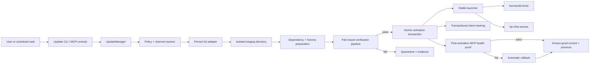
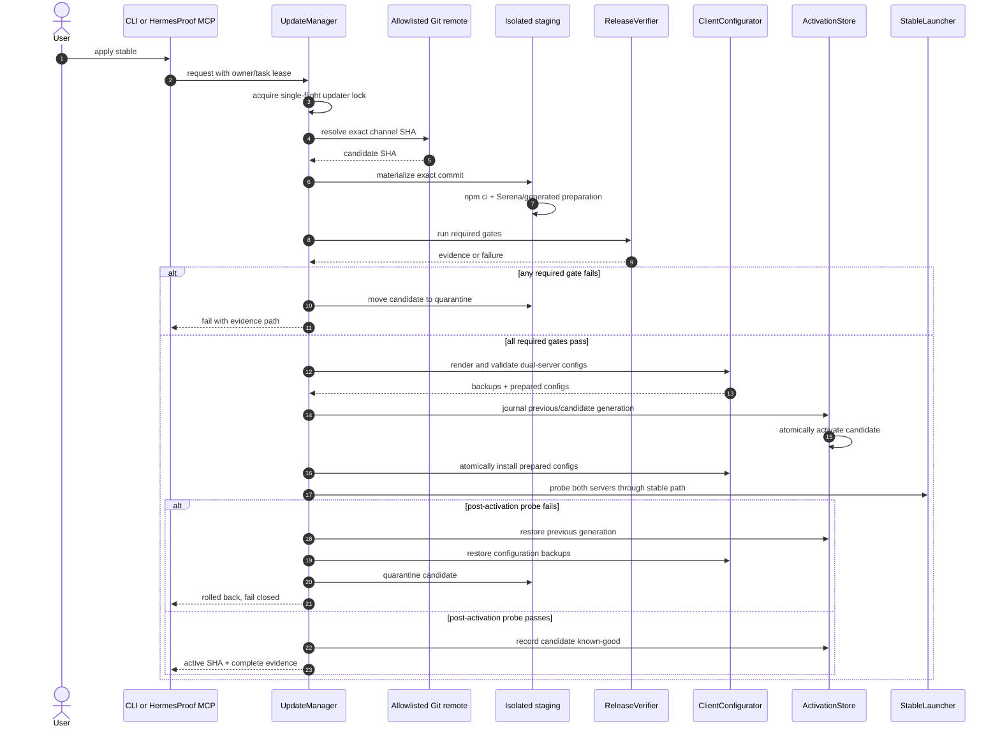
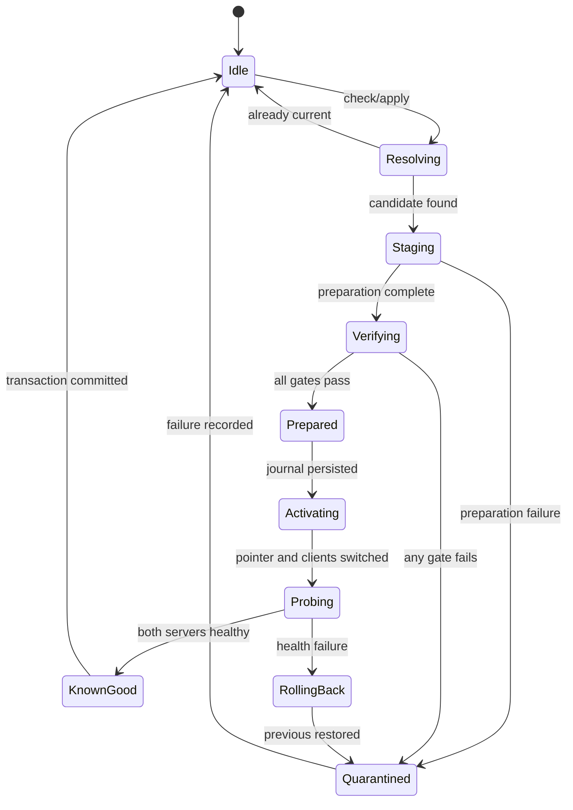
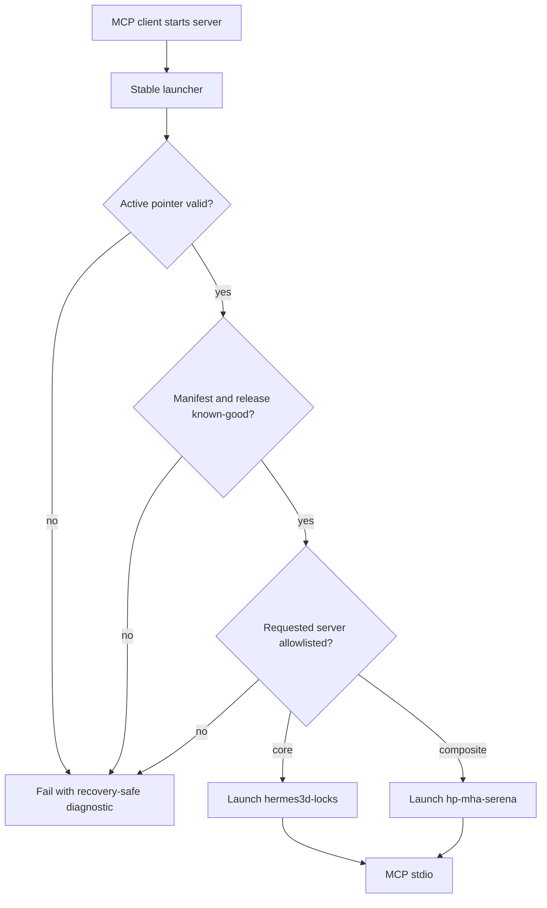
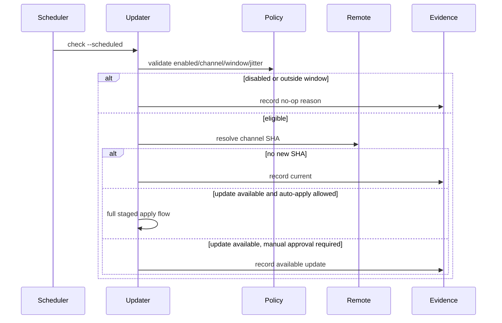
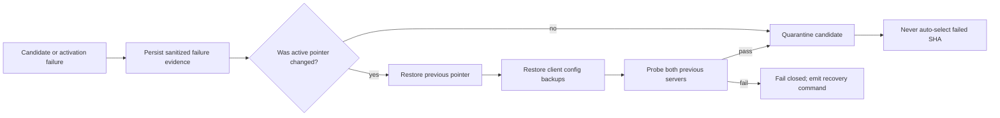
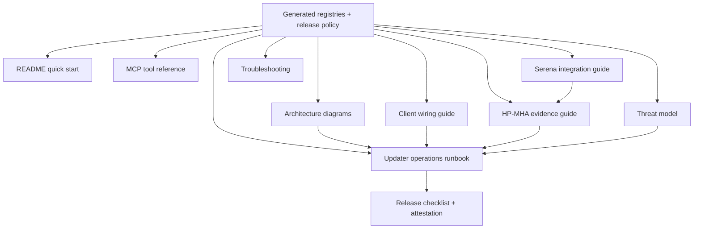

# HermesProof Safe Automatic Updater Design

**Date:** 2026-08-09

**Status:** Approved design awaiting implementation-plan review

**Release branch:** `release/hp-mha-serena-shippable`

**Primary distribution:** `https://gitlab.com/Ghenghis/HermesProof.git`

## Outcome

HermesProof will update an already-installed deployment without modifying a developer checkout, losing a known-good version, bypassing Hermes locks, or leaving MCP clients pointed at a partial installation. A stable launcher will select immutable, versioned releases. An updater will discover, stage, verify, activate, monitor, and roll back releases. Both `hermes3d-locks` and `hp-mha-serena` will be installed and refreshed as one atomic product.

The same implementation will support manual updates, automatic scheduled updates, channel switching, health inspection, rollback, quarantine, and safe retention. It will be usable from a CLI and through lock-aware HermesProof MCP tools. Windows 11 is a first-class target; Linux/VPS operation is also required.

## Why an in-place pull is forbidden

The currently installed checkout at `G:\Github\hermes3d-mcp-lock-orchestrator` is on `codex/hermesproof-workspace-realtime-unlocks`, is ahead of its remote, and contains modified and untracked product files. Its package version is older than the shippable release. Pulling, resetting, cleaning, or overwriting that directory could destroy user work and could mix an incomplete release with running MCP processes.

The updater therefore treats all developer repositories as read-only inputs. It installs clean releases into a separate managed root and switches clients only after a complete candidate passes every required gate.

## Scope

The implementation includes:

- A cross-platform managed installation root.
- Immutable releases addressed by verified Git commit SHA.
- `stable` and `preview` update channels.
- Manual check, stage, apply, status, channel, scheduler, cleanup, and rollback operations.
- Scheduled refresh with jitter and a single-flight update lock.
- Fail-closed release verification and post-activation health checks.
- Atomic dual-server activation for `hermes3d-locks` and `hp-mha-serena`.
- Timestamped client-configuration backups and transactional rewiring.
- Serena 1.6.2.dev0 configuration/context regeneration and validation.
- Quarantine of failed candidates and recovery after interrupted updates.
- Current-plus-previous known-good retention.
- CLI, MCP, doctor, harness, evidence, generated-reference, and user documentation.
- End-to-end diagrams covering architecture, update, rollback, scheduling, and client execution.

The implementation does not:

- Modify, clean, reset, or delete a developer checkout.
- Merge branches or publish a release without the existing review process.
- Enable unrestricted Serena mutation or shell tools.
- Automatically run an unverified executable or dependency lifecycle script.
- Delete a previous known-good release during activation.
- Consume GitLab CI minutes for normal local verification.
- Hide an update failure or report success when any required proof fails.

## User experience

```text
node scripts/hermesproof-update.mjs status
node scripts/hermesproof-update.mjs check [--channel stable|preview]
node scripts/hermesproof-update.mjs apply [--channel stable|preview]
node scripts/hermesproof-update.mjs rollback
node scripts/hermesproof-update.mjs channel stable|preview
node scripts/hermesproof-update.mjs auto enable [--interval 6h] [--window 02:00-05:00]
node scripts/hermesproof-update.mjs auto disable
node scripts/hermesproof-update.mjs doctor --deep
node scripts/hermesproof-update.mjs cleanup [--older-than 7d]
```

`status` and `check` are read-only. `apply`, `rollback`, `channel`, scheduler mutation, and cleanup require the same workspace-owner-task lease discipline used by HermesProof mutation flows.

The default installed channel is `stable`. Automatic checking is enabled only when the installer is invoked with `--enable-auto-update` or when the user explicitly runs `auto enable`. Once enabled, stable-channel updates may apply automatically inside the configured maintenance window. Preview-channel automatic application requires an additional explicit opt-in.

## Managed layout

The default managed roots are:

- Windows: `%LOCALAPPDATA%\HermesProof`
- Linux: `${XDG_DATA_HOME:-~/.local/share}/hermesproof`

An explicit `HERMESPROOF_MANAGED_ROOT` may override the location after the path is canonicalized and validated. The override must not be a filesystem root, home directory, repository root, or an existing developer checkout.

```text
HermesProof/
├── bin/
│   ├── hermesproof-launch.mjs       stable client entry point
│   └── hermesproof-update.mjs       stable updater entry point
├── state/
│   ├── active-release.json          atomic pointer and generation
│   ├── update-policy.json           channel, cadence, window, jitter
│   ├── update-journal.json          crash-recovery transaction journal
│   ├── releases.json                verification and retention records
│   └── updater.lock                 single-flight lease/mutex
├── releases/
│   ├── <current-sha>/               immutable known-good release
│   └── <previous-sha>/              rollback release
├── staging/
│   └── <candidate-sha>-<nonce>/     incomplete candidate, never executable
├── quarantine/
│   └── <candidate-sha>-<reason>/    failed candidate plus sanitized evidence
├── evidence/<transaction-id>/       manifests, probes, tests, attestation
├── backups/clients/<timestamp>/     pre-change client configurations
└── logs/updater.ndjson              redacted structured audit log
```

The active pointer is JSON rather than a directory symlink, avoiding Windows privilege requirements. It is written to a sibling temporary file, flushed, validated, and atomically renamed. The stable launcher reads and validates it for every new process. Existing processes continue using their immutable release until their client reconnects.

## Architecture



### Components

`UpdateManager` is deterministic orchestration with injected filesystem, clock, process runner, Git, scheduler, client-config, and verifier adapters.

`ReleaseSource` resolves an allowlisted channel ref to a full commit SHA using exact argument arrays and never invokes a shell. GitLab is primary; a GitHub mirror may be a fallback only when it satisfies identical ancestry and verification rules.

`ReleaseStager` creates a unique candidate directory, materializes the exact commit, records origin/ref/SHA, and prevents the launcher from seeing it before verification.

`ReleasePreparer` installs locked dependencies, regenerates Serena contexts and generated references, and produces package hashes and an SBOM. Lifecycle scripts are disabled unless a reviewed allowlist documents a required script and hash.

`ReleaseVerifier` runs the complete gate set and produces machine-readable evidence. Any missing, skipped, malformed, or contradictory required result is failure.

`ActivationStore` owns the pointer, transaction journal, release registry, and crash recovery. It alone may change the active generation.

`ClientConfigurator` extends the existing installer so every selected client receives both servers through the stable launcher, with format validation and timestamped backups.

`StableLauncher` validates pointer, release path, server ID, entry-point containment, and known-good state, then starts one approved server with a reduced environment.

`SchedulerAdapter` manages a per-user Windows scheduled task or Linux systemd-user timer. It does not create an unbounded cron entry or root service.

`RetentionManager` preserves current and previous known-good releases. Failed candidates are quarantined; cleanup is delayed and path-contained.

## Channel and trust policy

| Channel | Ref | Automatic application |
|---|---|---|
| `stable` | `refs/heads/main` | Allowed after explicit auto-update enablement |
| `preview` | `refs/heads/release/hp-mha-serena-shippable` | Manual by default; separate opt-in required |

Allowed source URLs are exact normalized policy entries, initially `https://gitlab.com/Ghenghis/HermesProof.git`. Redirects to another host are rejected. Refs, SHAs, paths, server names, and channels use strict validation. A candidate must be a full lowercase hexadecimal Git SHA reachable from its configured channel ref.

The design supports signed-tag or Sigstore verification later without changing the state machine. Until signing is deployed, trust comes from the allowlisted remote, exact ancestry, locked dependencies, recorded hashes, SBOM, full local gates, and an activation attestation.

## End-to-end update flow



### Verification gates

A candidate must pass:

1. Source URL, channel ref, commit format, and ancestry validation.
2. Clean staged tree and expected repository identity.
3. Lockfile-only dependency installation with package-manager version recorded.
4. Dependency license/hash inventory and CycloneDX-compatible SBOM.
5. Secret and private-key pattern scan with redacted output.
6. Serena 1.6.2.dev0 version, required `languages`, context hashes, and read-only Hermes LSP validation.
7. Generated-reference drift checks for the 121-tool core and 26-tool composite registries.
8. Focused updater unit, state-machine, security, and recovery tests.
9. Full `npm test` with zero unexpected failures.
10. Strict truth gates without workspace-integrity, client-config, live-client, or harness skips.
11. HP-MHA measured matrix, card hashes, real Merkle proof, tamper rejection, and scheduler-level holdout isolation.
12. MCP initialize/list-tools/health handshake for `hermes3d-locks`, matching its generated catalog.
13. MCP initialize/list-tools/health handshake for `hp-mha-serena`, matching its generated catalog.
14. Self-hosting HermesProof lifecycle test performing staged update, rejection, activation, client rendering, and rollback through MCP controls.
15. Documentation link, Mermaid syntax, command example, version, channel, tool-count, and generated-reference validation.
16. No unfinished content marker, template marker, unexpected skip, or success-after-failure pattern in release evidence.

An optional external service may be unavailable, including LM Studio, Ollama, Docker, GitLab CI, or a browser runner. Absence is reported separately and cannot satisfy a required product gate. Every feature described as shipped needs a deterministic local probe or an explicitly advisory status.

## Atomic activation and crash recovery



At startup, the updater inspects `update-journal.json`:

- Before pointer change, it quarantines an incomplete candidate without touching active state.
- After pointer change but before client commit, it restores the previous pointer.
- After client commit but before health proof, it probes both servers and commits only if both pass.
- During rollback, it resumes restoration until pointer and all managed client configs agree.
- With a corrupt pointer, it selects only a registry entry marked known-good whose manifest and directory hashes still validate; otherwise it fails closed with a recovery command.

The active record includes schema version, generation, current SHA, previous SHA, activation time, channel, evidence digest, and release-manifest digest. Compare-and-swap generation checks prevent competing updater processes from overwriting one another.

## Launcher and process behavior

All clients point to `bin/hermesproof-launch.mjs` and pass `--server hermes3d-locks` or `--server hp-mha-serena`.



An update does not kill active MCP processes. Activation changes only subsequent launches. Managed clients receive a restart-required marker and may reconnect through the supervisor after in-flight requests drain. Forced termination is never the default.

## Client configuration

The existing client installer will:

- Render both `hermes3d-locks` and `hp-mha-serena` entries for every MCP-capable target.
- Point both entries to one stable launcher with different server arguments.
- Preserve unrelated user servers and settings.
- Detect duplicate legacy HermesProof entries and provide deterministic migration.
- Write a sibling temporary configuration, parse and validate it, confirm both entries, then atomically replace the original.
- Save timestamped backups and include their paths in evidence.
- Support dry-run redacted diffs.
- Verify every effective configuration and run live probes where safe.

Targets include Claude Desktop, Claude Code, Codex, Windsurf, Kilo Code, Cursor, VS Code/Copilot, and existing SDK/hook targets. Devin, LM Studio, and Ollama remain contexts or provider adapters when they do not expose native local MCP configuration. Documentation must distinguish client wiring from inference-provider integration.

## Serena preparation

Every staged release will:

- Confirm Serena 1.6.2.dev0.
- Validate `.serena/project.yml` against the current schema, including `languages`.
- Regenerate or validate contexts for Codex, Kilo Code, Windsurf, Devin, LM Studio, and Ollama.
- Verify context hashes against the shipped manifest.
- Run isolated onboarding when policy requires it.
- Exercise symbol overview, declaration, implementations, references, diagnostics, and file reads against representative TypeScript/JavaScript modules.
- Prove direct Serena mutation and shell tools remain denied unless routed through Hermes locks.

The dashboard count is not a release invariant. Evidence and docs distinguish default active tools, executable catalog tools, and the Hermes-exposed read-only semantic subset, preventing the earlier 29-versus-52 ambiguity.

## Automatic scheduling



Default cadence is six hours with deterministic per-installation jitter up to 30 minutes. Stable auto-apply occurs only inside the configured local maintenance window. Missed runs do not pile up. Network failure uses bounded exponential backoff and never changes the active release. Checks and normal validation run locally and consume no GitLab CI minutes.

Windows uses a per-user Task Scheduler task named `HermesProof Safe Update`. Linux uses a systemd user timer, with a documented user-cron fallback only when systemd user services are unavailable. Installation, inspection, and removal are idempotent and adapter-tested. Commands use absolute paths, platform APIs, and no secrets.

## MCP control surface

| Tool | Mutation | Purpose |
|---|---:|---|
| `hp_mha_update_status` | No | Active/previous SHA, channel, policy, health, scheduler, last result |
| `hp_mha_update_check` | No | Report a candidate without staging or activation |
| `hp_mha_update_apply` | Yes | Execute staged, verified, transactional update |
| `hp_mha_update_rollback` | Yes | Restore previous known-good release and client configs |
| `hp_mha_update_channel_set` | Yes | Change channel with preview risk acknowledgement |
| `hp_mha_update_auto_configure` | Yes | Enable, disable, or change cadence/window |
| `hp_mha_update_cleanup` | Yes | Run quarantine-aware protected retention cleanup |
| `hp_mha_update_evidence` | No | Return sanitized evidence metadata and digests |

Mutation tools require owner/task/workspace binding, an exact update lock, and idempotency key. Concurrent calls return the current transaction instead of starting another. Responses cannot claim success unless registry state, launcher probes, and evidence agree.

Adding tools changes the composite registry count. The registry remains authoritative; README tables, tool references, handshakes, tests, and counts must be generated rather than hand-edited.

## Failure, rollback, and quarantine



Rollback revalidates the previous release. If invalid, it searches only entries previously marked known-good and revalidates them. It never falls back to a dirty developer checkout. A quarantined SHA cannot be retried automatically unless its commit changes, policy clears the quarantine, or an operator invokes an explicit reviewed retry.

## Retention and disk safety

Current and previous known-good releases are protected. Staging directories older than 24 hours may be quarantined only when no journal or process lease references them. Inactive releases older than seven days may be listed as cleanup candidates. Automatic cleanup retains the protected pair plus at most one newer diagnostic quarantine.

Cleanup resolves and checks every absolute target inside the managed root. It reports reclaimable size first. It never deletes caches, worktrees, repositories, `node_modules`, or test artifacts outside the managed root. Stale-project cleanup remains a separate explicitly authorized workflow.

## Observability and visual proof

Every transaction creates a redacted evidence bundle containing:

- transaction ID, channel, ref, resolved SHA, timestamps, platform, and updater version;
- before/after pointer records;
- lockfile, installed-package, SBOM, source-manifest, and evidence digests;
- Serena version, context hashes, semantic probes, and mutation-denial proof;
- focused/full tests with unexpected skips treated as failures;
- both MCP catalogs and handshake/health results;
- HP-MHA matrix, card hashes, holdout isolation, Merkle root, and tamper result;
- client targets, redacted diffs, backups, and effective-config checks;
- rollback/quarantine state;
- documentation/generated-reference drift;
- final activation attestation.

CLI/MCP status exposes: resolving, staging, preparing, verifying, activating, probing, complete, rolling-back, or quarantined. A dashboard may visualize state, but machine-readable evidence remains authoritative.

## Documentation synchronization

Implementation is incomplete until all related documentation is updated and cross-linked:

- `README.md`: installation, updates, channels, both servers, rollback, and generated counts.
- Architecture guide: updater boundary, trust model, launcher, state machine, and dual-server topology.
- Client guide: clean install, legacy migration, target matrix, backups, reconnect behavior, and effective-config verification.
- Serena guide: 1.6.2.dev0 schema, `languages`, active/catalog/exposed counts, contexts, onboarding, and lock restrictions.
- HP-MHA guide: updater harness card, self-hosting scenario, measured attribution, Merkle evidence, and failure behavior.
- Operations runbook: scheduled refresh, maintenance windows, offline behavior, quarantine, rollback, crash recovery, disk retention, and Windows/VPS commands.
- MCP reference: generated updater schemas and regenerated registry totals.
- Security/threat model: source validation, dependency scripts, path containment, config redaction, leases, atomicity, and supply-chain evidence.
- Troubleshooting: dirty repository, missing active release, corrupt pointer, blocked candidate, Serena mismatch, client mismatch, and scheduler failure.
- Release checklist, changelog, and version metadata: exact publication gates and evidence.

Shared generated facts must supply versions, refs, names, and counts. A documentation test fails when a diagram cannot parse, a command references a missing option, a link breaks, a count differs from its registry, or an operational path lacks both success and recovery instructions.

### Documentation map



## Test strategy

Implementation follows test-driven development.

### Unit and property tests

- Channel/ref/SHA/source allowlist parsing, including malicious inputs.
- Managed-root containment and rejection of roots, homes, repos, traversal, junction escape, and symlink escape.
- State-machine transitions and idempotency.
- Atomic pointer compare-and-swap and torn/corrupt records.
- Redaction of URLs, environment, config, and process output.
- Retention protection and size reporting.
- Schedule/jitter/window/backoff across daylight-saving and clock changes.
- Exact process argument arrays and reduced environment.

### Adapter and integration tests

- Temporary Git remote with stable/preview and multiple commits.
- Interrupted staging, verification, pointer switch, client switch, probe, and rollback recovery.
- Failed dependency, test, Serena, registry, Merkle, handshake, documentation, and post-activation gates.
- Client backup/replace/restore for JSON, JSONC, and TOML.
- Windows Task Scheduler and Linux systemd-user command generation plus no-mutation dry runs.
- A running old process while a new release activates.
- Protected retention and quarantine retry rules.

### End-to-end product proof

1. Bootstrap a managed installation from a local remote at release A.
2. Configure a representative client with both servers through the launcher.
3. Prove both release-A servers over MCP stdio.
4. Publish release B to the fixture stable ref and run `check`.
5. Apply B through the HermesProof MCP update tool.
6. Observe progress/evidence through MCP status and evidence tools.
7. Prove new launches select B while an existing A process remains alive.
8. Introduce tampered C and prove quarantine without pointer/client change.
9. Roll back through MCP and prove both servers/configs select A.
10. Simulate interrupted activation and prove recovery to one consistent generation.
11. Exercise the scheduler adapter in test scope and prove single-flight behavior.
12. Run deep doctor, full tests, strict truth gates, docs gates, and evidence verification with zero unexpected skips.

Windows E2E runs locally to conserve GitLab compute. A Linux/VPS smoke uses the same fixture when a runner is available. GitLab CI is reserved for the final merge-request pipeline after local proof.

## Acceptance criteria

The updater is shippable only when:

- Dirty or ahead developer repositories are never modified.
- A full-SHA candidate cannot activate before every required gate passes.
- Both servers switch atomically through one launcher generation.
- Both server catalogs and health handshakes match generated references.
- Client changes are validated, backed up, reversible, and preserve unrelated settings.
- Pre-activation failure leaves current release and clients unchanged.
- Post-activation failure restores the previous release and configs.
- Crash recovery is idempotent at every journal boundary.
- Automatic update is safely manageable on Windows and Linux without system privilege.
- Stable and preview policy cannot be silently broadened.
- Current/previous remain protected and cleanup cannot escape managed storage.
- Serena 1.6.2.dev0 probes pass and unsafe direct mutation stays denied.
- HP-MHA evidence is measured, tamper-detecting, and fail-closed.
- HermesProof MCP controls drive and observe the full update/rollback E2E.
- All related docs and diagrams are current, linked, generated where appropriate, and drift-tested.
- `npm test`, strict truth gates, updater E2E, MCP self-hosting E2E, docs gates, and deep doctor pass with zero unexpected failure or skip.
- The release branch is clean, reviewable, pushed to GitLab, and has a fresh attestation.

## Delivery slices

Implementation will use reviewable commits:

1. Updater state model, policy, safe process/path adapters, and unit tests.
2. Staging, preparation, verification, evidence, quarantine, and integration tests.
3. Launcher, activation, recovery, rollback, retention, and E2E tests.
4. Dual-server client migration and effective-config verification.
5. Scheduler adapters and automatic refresh policy.
6. MCP controls, CLI, doctor, and self-hosting harness.
7. Generated references, all related guides, diagrams, troubleshooting, and drift tests.
8. Final Windows proof, optional VPS smoke, attestation, and GitLab review update.

No slice may weaken fail-closed behavior. A newly discovered gap becomes a corrected implementation/test/doc item inside this boundary or a named release blocker; it cannot be silently deferred while the product is called complete.
