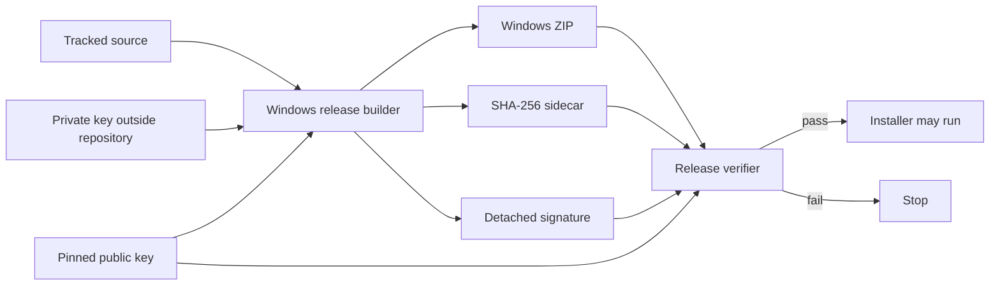

# HermesProof Offline Release Signing Design

**Date:** 2026-08-09

**Status:** Approved under the user's standing E2E authorization

**Branch:** `release/hp-mha-serena-shippable`

**Distribution:** `https://gitlab.com/Ghenghis/HermesProof`

## Outcome

Every official HermesProof Windows ZIP will have a SHA-256 sidecar and a detached Ed25519 signature. A pinned public key and repository verifier will prove the archive came from the HermesProof release key and has not changed. The official build fails closed when the private key is missing, malformed, or does not match the pinned public key. Private key material stays outside the repository and release payload.

## Approaches considered

### Offline Ed25519 - selected

Node.js provides Ed25519 without another package. It is fast on Windows 11 and a VPS, works offline, and consumes no GitLab compute. The public key is pinned in the repository and the private key is stored under `C:\private` with user-only access. Rotation requires a reviewed public-key change.

### Sigstore/cosign - deferred

Sigstore adds identity and transparency-log evidence, but cosign is not installed and adds network and identity dependencies. It can later be added as a second signature without weakening the offline path.

### Authenticode - rejected for the ZIP

Authenticode suits a future MSI or executable. It needs a code-signing certificate and is not the detached-signature model for the current ZIP.

## Scope

The implementation includes Node.js `crypto` signing, a tracked public key, an external private key, exact `.sha256` and `.sig` sidecars, a strict verifier, fail-closed official builds, explicitly labeled unsigned development builds, tamper tests, and release/security documentation.

It excludes private-key publication, silent unsigned fallback, automatic key upload, and claims of Authenticode or Sigstore verification.

## Artifact contract

```text
HermesProof-v0.9.0-rc.1-windows-x64.zip
HermesProof-v0.9.0-rc.1-windows-x64.zip.sha256
HermesProof-v0.9.0-rc.1-windows-x64.zip.sig
hermesproof-release-ed25519-public.pem
verify-hermesproof-release.mjs
SHA256SUMS.txt
```

The checksum sidecar contains a lowercase 64-character digest, two spaces, and the exact ZIP basename. The strict UTF-8 signature envelope is:

```json
{
  "schema": "hermesproof.release-signature.v1",
  "algorithm": "Ed25519",
  "artifact": "HermesProof-v0.9.0-rc.1-windows-x64.zip",
  "sha256": "<lowercase hex digest>",
  "keyFingerprint": "sha256:<public SPKI DER digest>",
  "signature": "<base64 detached signature>"
}
```

The signature covers a canonical payload containing schema, algorithm, exact artifact basename, digest, and fingerprint. Unknown fields are rejected. Archive bytes are bound through a freshly computed digest.

## Architecture



The builder creates and verifies its internal manifest, compresses the stage, computes the ZIP digest, proves the private key matches the pinned public key, writes sidecars, and immediately verifies them. The standalone verifier defaults to exact sibling sidecars and the pinned public key. Every input must be a regular file.

## Key management

The official key is supplied with `HERMESPROOF_RELEASE_SIGNING_KEY_FILE`; it is never inferred from the repository. Key generation is separate, refuses overwrite, creates PKCS#8 private and SPKI public PEM files, and limits private-file access to the current Windows user where supported.

The builder derives the public key from the private key and requires its fingerprint to match the tracked key. Rotation requires a new external private key, reviewed public-key commit, transition release note with old and new fingerprints, and retention of versioned old public keys for historical verification.

## Failure behavior

Official signing fails if the key path is absent, the key is not a regular Ed25519 private key, its public key does not match, output cannot be written, or self-verification fails. Verification rejects malformed or extra JSON fields, noncanonical digest/base64, unexpected filenames, fingerprint mismatch, checksum mismatch, altered bytes, and invalid signatures. Presence alone never counts as proof.

## User workflow

```powershell
$env:HERMESPROOF_RELEASE_SIGNING_KEY_FILE = 'C:\private\HermesProof-release-ed25519-private.pem'
npm run build:windows-release
node scripts/verify-hermesproof-release.mjs --artifact dist\HermesProof-v0.9.0-rc.1-windows-x64.zip
```

Users verify downloaded assets before extraction or execution of `install-hermesproof.ps1`.

## Test strategy

- Sign and verify with temporary Ed25519 keys.
- Prove canonical payload and fingerprint behavior.
- Reject wrong key types and public/private mismatch.
- Check exact signed outputs and missing-key failure.
- Label unsigned development output explicitly.
- Reject archive, checksum, signature, metadata, and public-key tampering.
- Make the release-checksum gate verify cryptography, not only presence.
- Verify the exact final ZIP through install, repair, rollback, uninstall, and purge.

## Documentation and publication

README links the verification quick start and architecture. The runbook covers secure build, verification, GitLab upload, rotation, and recovery. The threat model documents the offline trust anchor. Troubleshooting distinguishes missing keys, key mismatch, corrupt downloads, and invalid historical signatures.

GitLab is the only publication target. Local tests and signing consume no CI minutes; only the final merge-request/Pages pipeline is reserved for GitLab.

## Acceptance criteria

- Official builds cannot succeed without a matching Ed25519 private key.
- The private key never appears in Git status, manifests, logs, proof, or ZIP.
- The ZIP has exact checksum and signature sidecars.
- The verifier passes the untouched release and rejects every tamper fixture.
- The release-checksum gate performs cryptographic verification.
- The exact signed archive passes the complete Windows lifecycle.
- Tests, docs gates, Serena/HP-MHA E2E, and truth gates pass.
- The GitLab release publishes all verification assets and records the ZIP digest and public-key fingerprint.
